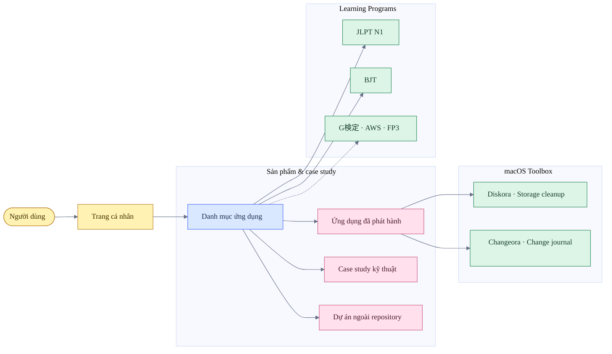
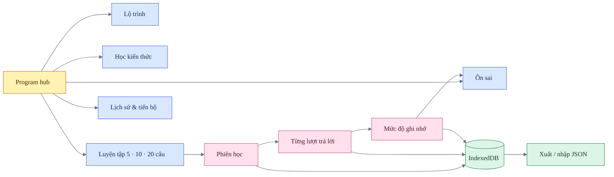
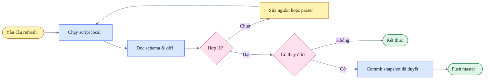

# thangldw.github.io

Portfolio tĩnh, các case study kỹ thuật và hệ sinh thái ứng dụng học tập chạy trực tiếp trên trình duyệt.

**Website:** [thangldw.github.io](https://thangldw.github.io/)

## Bản đồ sản phẩm



## Bề mặt đang phát hành

| Nhóm | Route | Vai trò |
|---|---|---|
| Hồ sơ | [`/`](https://thangldw.github.io/) | Hồ sơ, nguyên tắc làm việc và dự án nổi bật |
| Danh mục | [`/apps/`](https://thangldw.github.io/apps/) | Điểm vào chung cho toàn bộ ứng dụng |
| Diskora | [Release 1.0.0](https://github.com/thangldw/toolbox/releases/tag/diskora-v1.0.0) | Phân tích dung lượng và dọn dẹp macOS theo cơ chế duyệt trước khi xóa |
| Changeora | [Release 1.0.0](https://github.com/thangldw/toolbox/releases/tag/changeora-v1.0.0) | Ghi snapshot và giải thích thay đổi tệp cục bộ trên macOS |
| JLPT N1 | [`/apps/jlpt-n1/`](https://thangldw.github.io/apps/jlpt-n1/) | Hub gồm 12 công cụ từ vựng, ngữ pháp và đọc hiểu |
| BJT | [`/apps/bjt-study/`](https://thangldw.github.io/apps/bjt-study/) | Lộ trình Business Japanese, luyện tập và ôn sai |
| NamiQuant | [`/apps/namiquant/`](https://thangldw.github.io/apps/namiquant/) | Case study giới hạn của hệ thống giao dịch riêng |
| KakeFlow | [`/apps/kakeflow/`](https://thangldw.github.io/apps/kakeflow/) | Quản lý tài chính gia đình theo hướng local-first |
| Data Copilot | [`/apps/data-copilot/`](https://thangldw.github.io/apps/data-copilot/) | Workbench phân tích dữ liệu trên trình duyệt |
| Pipeline | [`/apps/pipeline/`](https://thangldw.github.io/apps/pipeline/) | Snapshot quan sát quy trình ELT |
| Earthquake Intelligence | [`/apps/earthquake-intelligence/`](https://thangldw.github.io/apps/earthquake-intelligence/) | Case study dữ liệu động đất USGS |
| Asian City Climate | [`/apps/city-climate/`](https://thangldw.github.io/apps/city-climate/) | Dữ liệu khí hậu và chất lượng không khí |

Các URL JLPT cũ chỉ còn trang chuyển hướng. Danh sách đầy đủ nằm trong [apps/URL-MIGRATION.md](apps/URL-MIGRATION.md).

## Kiến trúc learning program



`js/learning-history.js` là lớp dùng chung cho phiên học, đáp án, mastery, lịch ôn và trạng thái chương trình. `localStorage` chỉ giữ lựa chọn giao diện của hai hub hiện tại.

## Nguyên tắc repository

- **Static-first:** HTML, CSS, JavaScript và dữ liệu được phát hành trực tiếp từ repository.
- **Một nguồn sự thật:** metadata dự án nằm trong `js/projects-data.js`; lịch sử học nằm trong IndexedDB.
- **Không nhân đôi ứng dụng:** route cũ chỉ chuyển hướng tới route canonical.
- **Refactor trước khi mở rộng:** ưu tiên mô-đun dùng chung, xóa mã chết và không tạo biến thể copy-paste.
- **Dữ liệu có giới hạn:** dữ liệu sinh tự động phải có schema rõ ràng và giới hạn kích thước.
- **Không commit rác:** không đưa cache, môi trường ảo, file build, ảnh tạm hay secret vào Git.
- **Kiểm tra trước khi push:** validator, syntax check và kiểm tra diff là release gate bắt buộc.

## Chạy local

Yêu cầu: Python 3 và trình duyệt hiện đại.

```bash
python3 -m http.server 4173
```

Mở [http://127.0.0.1:4173/](http://127.0.0.1:4173/). Không mở file HTML trực tiếp vì ứng dụng sử dụng route gốc và các API của trình duyệt.

## Thêm hoặc cập nhật dự án

Chỉnh sửa `js/projects-data.js`:

- `featured: true` và `featuredOrder` duy nhất để xuất hiện trên trang chủ;
- `featured: false` để chỉ xuất hiện trong danh mục;
- `featuredDescription` dùng cho rail trang chủ;
- `description` dùng cho catalog;
- thêm route canonical vào `sitemap.xml` nếu có trang công khai trong repository.

## Làm mới dữ liệu

Repository không tự động cập nhật dữ liệu nghiệp vụ. Mọi snapshot được tạo local, kiểm tra diff rồi mới commit.



### Market snapshot

```bash
python3 -m venv .venv
source .venv/bin/activate
python3 -m pip install pandas pyarrow
python3 scripts/fetch_stocks.py
```

Đầu ra:

- `apps/data-copilot/data/stocks.parquet`
- `apps/data-copilot/data/meta.json`
- `apps/data-copilot/data/runs.json`

### Public signals

```bash
python3 scripts/fetch_public_signals.py
```

Dữ liệu được ghi vào `apps/public-signals/data/`.

## Kiểm tra và phát hành

```bash
python3 scripts/validate_site.py
git diff --check
git status --short
```

Validator kiểm tra HTML, ID trùng, liên kết local, metadata social, sitemap, redirect chain và dependency font bên ngoài. GitHub Pages phát hành trực tiếp từ nhánh `master`.

## Cấu trúc repository

```text
.
├── apps/       # ứng dụng, case study, dữ liệu và redirect tương thích
├── assets/     # ảnh social và icon font local
├── css/        # token và style dùng chung
├── js/         # registry, hành vi chung và learning history
├── scripts/    # validator và công cụ refresh thủ công
├── index.html
├── sitemap.xml
└── robots.txt
```

## Quy chuẩn sơ đồ

Sơ đồ Mermaid trong repository dùng ngôn ngữ bảng trắng lấy cảm hứng từ Miro:

- một hướng đọc chính;
- nhãn ngắn, động từ rõ và connector có ý nghĩa;
- nhóm bằng `subgraph`, không dùng màu để thay thế nội dung;
- bốn màu sticky-note cố định: vàng cho điểm bắt đầu, xanh dương cho cấu trúc, hồng cho hành động, xanh lá cho kết quả;
- đường viền mảnh, không đổ bóng và không trang trí nếu không mang thông tin.

Tham khảo chính thức: [Miro Flowchart Templates](https://miro.com/templates/flowcharts/), [Miro Colors](https://help.miro.com/hc/en-us/articles/360017572374-Colors) và [Miro Brand Center](https://help.miro.com/hc/en-us/articles/13061918433426-Brand-center).

## Tài liệu liên quan

- [QA toàn repository](design-qa.md)
- [Audit hệ sinh thái học tiếng Nhật](japanese-app-audit.md)
- [QA JLPT N1](apps/jlpt-n1/design-qa.md)
- [QA BJT](apps/bjt-study/design-qa.md)
- [Danh sách URL tương thích](apps/URL-MIGRATION.md)
