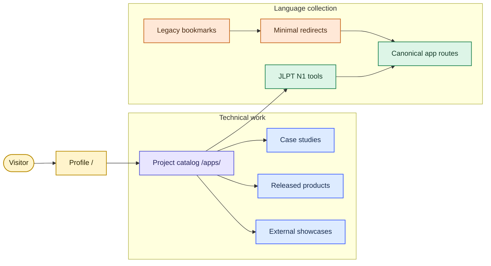
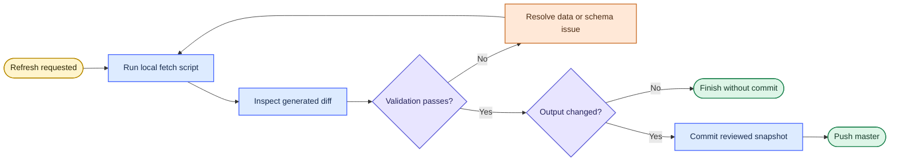

# thangldw.github.io

A build-free portfolio for technical case studies, released side projects, and browser-based JLPT N1 learning tools.

**Public site:** [thangldw.github.io](https://thangldw.github.io/)

## Site map

The repository has one publishing surface and three content groups. Project metadata is centralized so the homepage rail and project catalog stay aligned.



## Published surfaces

| Surface | Route | Notes |
|---|---|---|
| Profile | [`/`](https://thangldw.github.io/) | Resume, working principles, and featured projects |
| Project catalog | [`/apps/`](https://thangldw.github.io/apps/) | Technical work and language collection |
| NamiQuant | [`/apps/namiquant/`](https://thangldw.github.io/apps/namiquant/) | Private system; bounded public case study |
| KakeFlow | [`/apps/kakeflow/`](https://thangldw.github.io/apps/kakeflow/) | Released local-first household finance app |
| Data Copilot | [`/apps/data-copilot/`](https://thangldw.github.io/apps/data-copilot/) | Browser-native analytics workbench |
| Pipeline Observability | [`/apps/pipeline/`](https://thangldw.github.io/apps/pipeline/) | Manual operational snapshot of the ELT process |
| Earthquake Intelligence | [`/apps/earthquake-intelligence/`](https://thangldw.github.io/apps/earthquake-intelligence/) | USGS case study with a live browser overlay |
| Asian City Climate | [`/apps/city-climate/`](https://thangldw.github.io/apps/city-climate/) | Open-Meteo/CAMS historical and current views |
| Proofline | [`/proofline/`](https://thangldw.github.io/proofline/) | External showcase |
| RAGOps | [`/ragops/`](https://thangldw.github.io/ragops/) | External showcase |
| Maintainer Defense | [GitHub](https://github.com/thangldw/awesome-maintainer-defense) | Public repository and CLI |

Canonical JLPT routes live under `apps/`. Compatibility routes are documented in [`apps/URL-MIGRATION.md`](apps/URL-MIGRATION.md).

## Repository principles

- **Static first.** HTML, CSS, JavaScript, local data, and local fonts ship directly from the repository.
- **No custom GitHub Actions.** Data refreshes are explicit local operations reviewed before commit.
- **One project registry.** Technical project metadata lives in [`js/projects-data.js`](js/projects-data.js).
- **No duplicate apps.** Old URLs contain redirect pages only; canonical routes contain the application code.
- **Bounded generated data.** Refresh scripts retain at most 30 run-history records.
- **No external font services.** The site uses system stacks and small local icon-font subsets.
- **Validate before publishing.** Local references, metadata, redirects, sitemap entries, and duplicate IDs are checked together.

## Work locally

Requirements: Python 3 and a current browser.

```bash
python3 -m http.server 4173
```

Open [http://127.0.0.1:4173/](http://127.0.0.1:4173/). A local server is required because the site uses root-relative routes and browser APIs.

## Add or update a project

Edit [`js/projects-data.js`](js/projects-data.js). The catalog reads every entry automatically.

- Set `featured: true` and a unique `featuredOrder` to include a project in the homepage rail.
- Set `featured: false` to keep it catalog-only.
- Use a short `featuredDescription` for the rail and a fuller `description` for the catalog.
- Add the canonical route to `sitemap.xml` when the project has a local public page.

## Refresh data manually

The repository intentionally contains no scheduled workflow. Current earthquake, weather, and air-quality overlays are fetched in the browser. Committed datasets remain stable historical baselines and offline fallbacks.



### Market snapshot

The stock refresh requires `pandas` and `pyarrow`.

```bash
python3 -m venv .venv
source .venv/bin/activate
python3 -m pip install pandas pyarrow
python3 scripts/fetch_stocks.py
```

Generated files:

- `apps/data-copilot/data/stocks.parquet`
- `apps/data-copilot/data/meta.json`
- `apps/data-copilot/data/runs.json`

### Public-signal baseline

This refresh uses Python's standard library and keyless public APIs.

```bash
python3 scripts/fetch_public_signals.py
```

Generated files live in `apps/public-signals/data/`.

## Validate and publish

```bash
python3 scripts/validate_site.py
git diff --check
```

The validator checks:

- HTML parsing and duplicate IDs;
- local `href` and `src` targets;
- canonical, Open Graph, and Twitter metadata;
- sitemap coverage;
- compatibility redirects and redirect chains;
- accidental external font dependencies.

GitHub Pages publishes the `master` branch through the repository's Pages setting. No repository-owned deployment workflow is required.

## Repository layout

```text
.
├── apps/                  # apps, case studies, data, and compatibility redirects
├── assets/                # shared social images and local icon fonts
├── css/                   # shared design system and page styles
├── js/                    # shared navigation, project registry, and behavior
├── scripts/               # local validation and manual data refreshes
├── index.html             # profile homepage
├── sitemap.xml
└── robots.txt
```

## Diagram style

Mermaid diagrams follow a Miro-inspired visual system:

- one obvious reading direction;
- standard flowchart shapes with short labels;
- visible, labeled connectors;
- equal spacing and aligned groups;
- a small semantic palette rather than decorative color;
- text labels that preserve meaning without relying on color alone.

References: [Miro flowchart guidance](https://miro.com/flowchart/how-to-make-a-flowchart/), [Miro mapping and diagramming](https://help.miro.com/hc/en-us/articles/4403634496402-Miro-for-mapping-diagramming), and [Miro diagram design](https://miro.com/blog/diagram-design/).

## Cleanup policy

Before publishing structural changes:

1. remove ignored operating-system artifacts;
2. keep only referenced shared assets;
3. preserve intentional compatibility redirects;
4. avoid committing caches, environments, build outputs, or secrets;
5. run the validator and inspect the complete diff.
