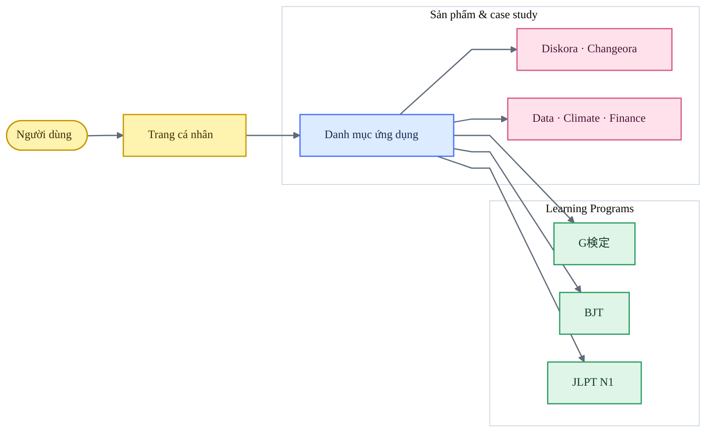
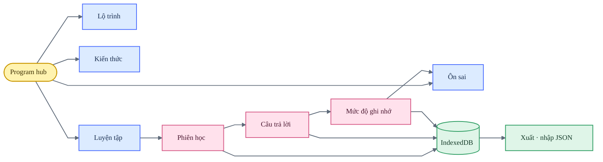
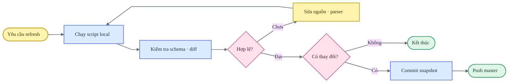

# thangldw.github.io

Portfolio tĩnh, case study kỹ thuật và các chương trình học chạy trực tiếp trong trình duyệt.

**Website:** [thangldw.github.io](https://thangldw.github.io/)

## Bản đồ sản phẩm



## Bề mặt đang phát hành

| Nhóm | Route | Vai trò |
|---|---|---|
| Hồ sơ | [`/`](https://thangldw.github.io/) | Hồ sơ, nguyên tắc làm việc và dự án nổi bật |
| Danh mục | [`/apps/`](https://thangldw.github.io/apps/) | Điểm vào chung cho toàn bộ ứng dụng |
| G検定 | [`/apps/gkentei/`](https://thangldw.github.io/apps/gkentei/) | Lộ trình 11 lĩnh vực, 495 keyword và luyện thi 145 câu |
| BJT | [`/apps/bjt-study/`](https://thangldw.github.io/apps/bjt-study/) | Business Japanese, luyện tập và ôn sai |
| JLPT N1 | [`/apps/jlpt-n1/`](https://thangldw.github.io/apps/jlpt-n1/) | Hub gồm 12 công cụ từ vựng, ngữ pháp và đọc hiểu |
| Diskora | [Release 1.0.0](https://github.com/thangldw/toolbox/releases/tag/diskora-v1.0.0) | Phân tích dung lượng và dọn dẹp macOS có bước duyệt |
| Changeora | [Release 1.0.0](https://github.com/thangldw/toolbox/releases/tag/changeora-v1.0.0) | Ghi snapshot và giải thích thay đổi tệp cục bộ |
| NamiQuant | [`/apps/namiquant/`](https://thangldw.github.io/apps/namiquant/) | Case study giới hạn của hệ thống giao dịch riêng |
| KakeFlow | [`/apps/kakeflow/`](https://thangldw.github.io/apps/kakeflow/) | Quản lý tài chính gia đình theo hướng local-first |
| Data Copilot | [`/apps/data-copilot/`](https://thangldw.github.io/apps/data-copilot/) | Workbench phân tích dữ liệu trên trình duyệt |
| Pipeline | [`/apps/pipeline/`](https://thangldw.github.io/apps/pipeline/) | Snapshot quan sát quy trình ELT |
| Earthquake Intelligence | [`/apps/earthquake-intelligence/`](https://thangldw.github.io/apps/earthquake-intelligence/) | Case study dữ liệu động đất USGS |
| Asian City Climate | [`/apps/city-climate/`](https://thangldw.github.io/apps/city-climate/) | Dữ liệu khí hậu và chất lượng không khí |

Các URL JLPT cũ chỉ còn trang chuyển hướng. Bảng đối chiếu nằm trong [apps/URL-MIGRATION.md](apps/URL-MIGRATION.md).

## Kiến trúc Learning Programs



`js/learning-history.js` là lớp dùng chung cho phiên học, câu trả lời, mastery, lịch ôn và trạng thái chương trình. `localStorage` chỉ giữ tùy chọn giao diện; dữ liệu học được lưu local-first trong IndexedDB.

## Nguyên tắc repository

- **Static-first:** phát hành trực tiếp HTML, CSS, JavaScript và dữ liệu từ repository.
- **Một nguồn sự thật:** metadata dự án ở `js/projects-data.js`; lịch sử học ở IndexedDB.
- **Canonical route:** route cũ chỉ chuyển hướng, không chứa bản sao ứng dụng.
- **Shared-first:** ưu tiên token, module và hành vi dùng chung trước khi mở rộng.
- **Dữ liệu có kiểm soát:** snapshot sinh tự động phải có schema, giới hạn và diff có thể duyệt.
- **Repository sạch:** không commit cache, môi trường ảo, build artifact, ảnh tạm hoặc secret.
- **Release gate:** audit UI, validator và kiểm tra diff phải đạt trước khi push.

## Chạy local

Yêu cầu Python 3 và trình duyệt hiện đại:

```bash
python3 -m http.server 4173
```

Mở [http://127.0.0.1:4173/](http://127.0.0.1:4173/). Không mở HTML trực tiếp vì ứng dụng dùng route gốc và API trình duyệt.

## Cập nhật catalog

Chỉnh `js/projects-data.js`:

- dùng `featured: true` và một `featuredOrder` duy nhất để đưa dự án lên trang chủ;
- dùng `featured: false` để chỉ hiển thị trong catalog;
- dùng `featuredDescription` cho rail trang chủ và `description` cho catalog;
- thêm route canonical công khai vào `sitemap.xml`.

## Làm mới dữ liệu

Repository không tự cập nhật snapshot nghiệp vụ. Mọi lần refresh đều chạy local, kiểm tra schema và diff trước khi commit.



### Market snapshot

```bash
python3 -m venv .venv
source .venv/bin/activate
python3 -m pip install pandas pyarrow
python3 scripts/fetch_stocks.py
```

Đầu ra nằm trong `apps/data-copilot/data/`.

### Public signals

```bash
python3 scripts/fetch_public_signals.py
```

Dữ liệu được ghi vào `apps/public-signals/data/`.

## Kiểm tra và phát hành

```bash
python3 scripts/audit_ui_standards.py
python3 scripts/validate_site.py
node scripts/smoke_learning_apps.mjs
git diff --check
git status --short
```

UI audit kiểm tra semantic HTML, accessibility, thứ tự CSS và token bắt buộc. Site validator kiểm tra HTML, ID trùng, liên kết local, social metadata, sitemap, redirect chain và font bên ngoài. Smoke test dùng Chrome headless có sẵn trên máy để chạy các luồng chính của G検定, BJT, JLPT N1, Vocabulary Exams, Vocabulary Tabs, Grammar Exams và Kanji Analysis mà không cần dependency npm. GitHub Pages phát hành trực tiếp từ `master`.

## Cấu trúc repository

```text
.
├── apps/       # ứng dụng, dữ liệu và redirect tương thích
├── assets/     # ảnh social và icon font local
├── css/        # token và style dùng chung
├── js/         # registry, hành vi chung và learning history
├── scripts/    # validator và script refresh thủ công
├── index.html
├── sitemap.xml
└── robots.txt
```

## Quy chuẩn sơ đồ

Mermaid trong repository dùng ngôn ngữ bảng trắng lấy cảm hứng từ Miro:

- một hướng đọc chính, connector tuyến tính và nhãn ngắn;
- subgraph chỉ dùng để nhóm quan hệ thật;
- vàng cho điểm bắt đầu, xanh dương cho cấu trúc, hồng cho hành động/quyết định, xanh lá cho kết quả;
- nền pastel, tương phản rõ, viền 1.5 px và không dùng màu thay cho nội dung;
- không đổ bóng hoặc thêm hình trang trí không mang thông tin.

Tham khảo: [Miro Flowchart Templates](https://miro.com/templates/flowcharts/), [Miro Flowchart Maker](https://miro.com/flowchart/), [Miro design language](https://help.miro.com/hc/en-us/articles/25286391619986-Miro-s-new-design-language-overview) và [Miro Brand Center](https://help.miro.com/hc/en-us/articles/13061918433426-Brand-center).

## Tài liệu liên quan

- [UI Standard 1.1](UI-STANDARDS.md)
- [QA toàn repository](design-qa.md)
- [Audit Learning Programs](japanese-app-audit.md)
- [QA G検定](apps/gkentei/design-qa.md)
- [QA BJT](apps/bjt-study/design-qa.md)
- [QA JLPT N1](apps/jlpt-n1/design-qa.md)
- [URL migration](apps/URL-MIGRATION.md)
