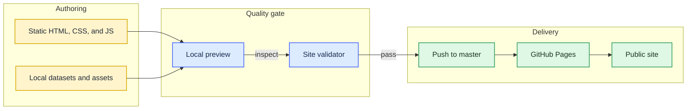
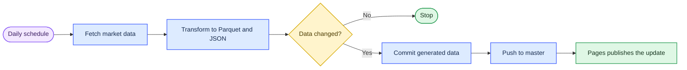

# thangldw.github.io

A static portfolio and a collection of browser-native engineering and Japanese-learning tools. The site is published at [thangldw.github.io](https://thangldw.github.io/) and runs without an application server or build step.

## What is here

| Area | Route | Purpose |
|---|---|---|
| Profile | [`/`](https://thangldw.github.io/) | English profile, working style, and selected projects |
| Japanese profile | [`/ja/`](https://thangldw.github.io/ja/) | Japanese-language professional profile |
| Project catalog | [`/apps/`](https://thangldw.github.io/apps/) | Technical demos and JLPT N1 learning tools |
| Proofline | [`/proofline/`](https://thangldw.github.io/proofline/) | Local-first engineering decision memory with exact source citations |
| NamiQuant | Internal | Local swing-trading decision support with deterministic scoring and risk gates |
| Data Copilot | [`/apps/data-copilot/`](https://thangldw.github.io/apps/data-copilot/) | Local CSV profiling, DuckDB-WASM SQL, and charts |
| Pipeline Observability | [`/apps/pipeline/`](https://thangldw.github.io/apps/pipeline/) | Freshness, coverage, run history, and data-quality signals |
| RAGOps | [`/projects/ragops/`](https://thangldw.github.io/projects/ragops/) | Case study for evaluation and release gates in RAG systems |

The catalog also contains the canonical JLPT N1 routes. Compatibility redirects are maintained in [`apps/URL-MIGRATION.md`](apps/URL-MIGRATION.md).

## System map

The diagram uses a Miro-style visual language: one reading direction, short labels, grouped responsibilities, labeled connectors, and a limited high-contrast palette.



## Local development

Requirements: Python 3 and a modern browser.

```bash
python3 -m http.server 4173
```

Open `http://127.0.0.1:4173/`. Root-relative links and browser APIs are not reliable when HTML files are opened directly from the filesystem, so use the local server.

## Validation

Run the repository validator before publishing:

```bash
python3 scripts/validate_site.py
```

It checks HTML parsing, duplicate IDs, local references, canonical URLs, redirect mappings, sitemap entries, and social metadata. It also rejects external font-service requests so typography remains local and predictable.

## Typography and icons

The UI uses operating-system fonts only:

- sans-serif: the native UI font with explicit Japanese fallbacks;
- serif: the native Mincho/serif stack where Japanese editorial text benefits from it;
- monospace: the native code font for SQL, metadata, and technical labels.

No Google Fonts request is made. Interface icons use a small local WOFF2 subset containing only the glyphs referenced by the site.

## Market-data refresh

The portfolio itself deploys from a normal push. A separate scheduled workflow exists only to refresh Data Copilot's market dataset.



The workflow is defined in [`.github/workflows/refresh-stocks.yml`](.github/workflows/refresh-stocks.yml). It can also be started manually from GitHub Actions.

## Publishing

GitHub Pages serves the repository root from `master`. Publishing requires only:

```bash
git push origin master
```

GitHub may show a `pages-build-deployment` run after a push; that is the platform's Pages publication job, not a custom application workflow.

## Repository layout

```text
.
├── apps/                 # product demos, JLPT tools, and compatibility redirects
├── assets/               # social images and local icon-font subsets
├── css/                  # shared tokens, layouts, app system, and local icons
├── ja/                   # Japanese profile
├── js/                   # shared site behavior
├── projects/             # case studies
├── scripts/              # validation and market-data refresh scripts
├── index.html            # English profile
├── sitemap.xml
└── robots.txt
```

## Documentation visuals

Workflow, graph, and architecture documentation should stay editable as Mermaid rather than being committed as opaque screenshots. Use Miro's [flowchart guidance](https://miro.com/flowchart/) and [mapping and diagramming guidance](https://help.miro.com/hc/en-us/articles/4403634496402-Miro-for-mapping-diagramming) as the visual baseline: standardized shapes, visible connectors, consistent alignment, swimlanes for ownership, layers or subgraphs for complexity, concise labels, and color as a secondary cue rather than the only cue.
