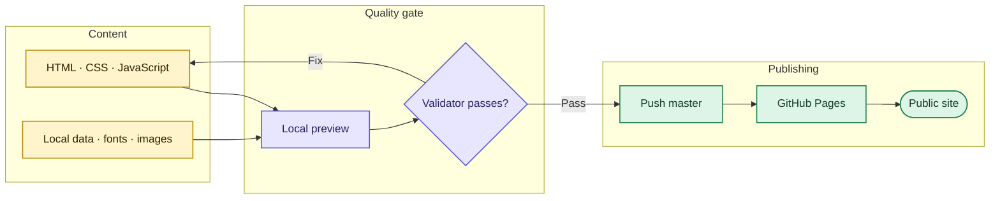
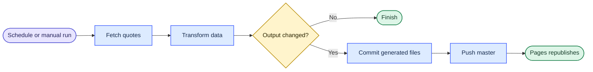

# thangldw.github.io

A build-free static portfolio for engineering side projects and browser-based JLPT N1 study tools. The public site is [thangldw.github.io](https://thangldw.github.io/).

## Published surfaces

| Surface | Location | Ownership |
|---|---|---|
| English profile | [`/`](https://thangldw.github.io/) | This repository |
| Project catalog | [`/apps/`](https://thangldw.github.io/apps/) | This repository |
| Data Copilot | [`/apps/data-copilot/`](https://thangldw.github.io/apps/data-copilot/) | This repository |
| Pipeline Observability | [`/apps/pipeline/`](https://thangldw.github.io/apps/pipeline/) | This repository |
| Proofline | [`/proofline/`](https://thangldw.github.io/proofline/) | External showcase |
| RAGOps | [`/ragops/`](https://thangldw.github.io/ragops/) | External showcase |
| NamiQuant | Catalog entry only | Internal project; no public application |

The canonical JLPT routes live under `apps/`. Old bookmarks are preserved by the redirects documented in [`apps/URL-MIGRATION.md`](apps/URL-MIGRATION.md); legacy application copies are not kept.

## Delivery map



## Work locally

Requirements: Python 3 and a current browser.

```bash
python3 -m http.server 4173
```

Open `http://127.0.0.1:4173/`. Use the server instead of opening files directly because the site relies on root-relative URLs and browser APIs.

Before publishing, run:

```bash
python3 scripts/validate_site.py
```

The validator checks HTML parsing, duplicate IDs, local file references, canonical and Open Graph metadata, sitemap coverage, every compatibility redirect, and accidental external font requests.

## Repository map

```text
.
├── .github/workflows/    # scheduled market-data refresh
├── apps/                 # applications and compatibility redirects
├── assets/               # local data, images, and icon-font subsets
├── css/                  # shared styles and design tokens
├── js/                   # shared browser behavior
├── scripts/              # validation and data-refresh utilities
├── index.html            # English profile
├── sitemap.xml
└── robots.txt
```

There is no package installation or production build. GitHub Pages serves the repository root from `master`; a normal `git push origin master` publishes through GitHub's Pages deployment job.

## Data refresh

The portfolio does not need a custom deployment workflow. The only repository workflow, [`.github/workflows/refresh-stocks.yml`](.github/workflows/refresh-stocks.yml), refreshes Data Copilot's market data on a schedule or by manual dispatch.



## UI and documentation rules

- Typography uses system sans-serif, serif/Mincho, and monospace stacks. No font service is called.
- Icons come from small local WOFF2 subsets; add a glyph only when an interface actually uses it.
- Diagrams remain editable Mermaid, not screenshot-only documentation.
- For workflows and infographics, follow Miro's [flowchart guidance](https://miro.com/flowchart/) and [mapping and diagramming guidance](https://help.miro.com/hc/en-us/articles/4403634496402-Miro-for-mapping-diagramming): one clear reading direction, short labels, aligned groups, visible connectors, swimlanes or subgraphs for ownership, and a small high-contrast palette whose meaning is reinforced by text.
