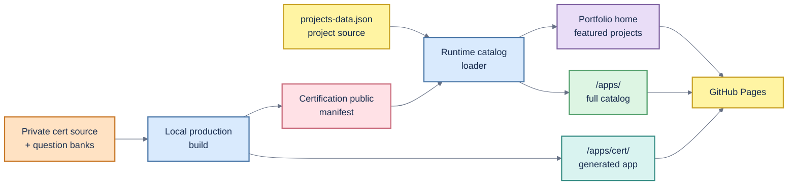

# thangldw.github.io

[English](#english) · [Tiếng Việt](#tiếng-việt) · [日本語](#日本語)

A dependency-light portfolio, application catalog, and static application host deployed with GitHub Pages.


```mermaid
%%{init: {"theme":"base","flowchart":{"curve":"basis","nodeSpacing":38,"rankSpacing":58},"themeVariables":{"background":"#F7F7F5","fontFamily":"Inter, Arial, sans-serif","lineColor":"#667085","primaryTextColor":"#172B4D"}}}%%
flowchart LR
    PJ["projects-data.json<br/>project source"]:::yellow --> PL["Runtime catalog<br/>loader"]:::blue
    CM["Certification public<br/>manifest"]:::pink --> PL
    PL --> H["Portfolio home<br/>featured projects"]:::purple
    PL --> A["/apps/<br/>full catalog"]:::green
    CS["Private cert source<br/>+ question banks"]:::orange --> CB["Local production<br/>build"]:::blue
    CB --> CA["/apps/cert/<br/>generated app"]:::cyan
    CB --> CM
    H --> GP["GitHub Pages"]:::yellow
    A --> GP
    CA --> GP
    classDef yellow fill:#FFF4A3,stroke:#C9A227,stroke-width:2px,color:#172B4D
    classDef blue fill:#D9EAFD,stroke:#4C78A8,stroke-width:2px,color:#172B4D
    classDef pink fill:#FFE1E6,stroke:#C96A7B,stroke-width:2px,color:#172B4D
    classDef purple fill:#E9DDF7,stroke:#8064A2,stroke-width:2px,color:#172B4D
    classDef green fill:#DDF5E3,stroke:#4F9D69,stroke-width:2px,color:#172B4D
    classDef orange fill:#FFE2C3,stroke:#C97A2B,stroke-width:2px,color:#172B4D
    classDef cyan fill:#D9F3F0,stroke:#3B8F87,stroke-width:2px,color:#172B4D
```

## English

### Purpose and operating model

`thangldw.github.io` is a static personal portfolio and application host. It has no application server, database, package-manager build step, or persistent backend. GitHub Pages serves committed HTML, CSS, JavaScript, JSON, fonts, images, and generated application artifacts.

- Production: [https://thangldw.github.io/](https://thangldw.github.io/)
- Default branch: `master`
- Runtime: standards-based browser APIs
- Deployment: GitHub Pages from the repository root
- Analytics: shared local script included once on non-redirect pages

### Public routes

| Route | Responsibility | Source of truth |
| --- | --- | --- |
| `/` | Portfolio profile and featured side projects | Root HTML plus shared project catalog |
| `/apps/` | Searchable and filterable application catalog | `js/projects-data.json` |
| `/apps/japan-pr-guide/` | Standalone permanent-residence planning tool | Route-local static assets |
| `/apps/cert/` | Generated Certification Library | Private `thangldw/cert` source repository |
| `/apps/cert/certifications-manifest.json` | Public certification metadata and counts | Local certification production build |
| `/404.html` | GitHub Pages fallback | Repository source |

Every sitemap route must have canonical metadata, a meaningful description, required Open Graph fields, and a valid local social image where applicable.

### Shared catalog architecture

`js/projects-data.json` is the only durable source for project metadata. `js/projects-data.js` validates and loads it at runtime with revalidation. Both the home page and `/apps/` wait for the same readiness promise before rendering.

The loader also reads `/apps/cert/certifications-manifest.json`. It derives the certification count, names, labels, and collection tags at runtime. Adding a certification therefore does not require manually editing the home page or application catalog.

The public certification manifest is an explicit metadata allowlist. It contains identity, issuer, routes, syllabus and public exam information, but not prompts, choices, answer keys, explanations, domains, glossary content, or learner data. Question banks remain inside the compiled React bundle.

### Repository layout

```text
thangldw.github.io/
├── index.html
├── 404.html
├── apps/
│   ├── index.html
│   ├── japan-pr-guide/
│   └── cert/                  # Generated artifact; do not hand-edit
├── assets/                    # Social images and local fonts
├── css/                       # Tokens, shared shell, and route styles
├── js/
│   ├── projects-data.json     # Project metadata source of truth
│   ├── projects-data.js       # Runtime loader and schema guard
│   └── shared behavior
├── scripts/                   # Static audits and browser smoke tests
├── robots.txt
└── sitemap.xml
```

### Local development

Requirements:

- Python 3.10 or later
- Node.js 22 or later
- Google Chrome at the standard macOS path, or `CHROME_BIN` pointing to a compatible executable

No dependency installation is required.

```bash
python3 -m http.server 4173
```

Open [http://localhost:4173/](http://localhost:4173/). Use a local server rather than opening files directly because runtime JSON loading requires HTTP.

### Quality gates

```bash
python3 scripts/audit_ui_standards.py
python3 scripts/validate_site.py
node scripts/smoke_cert.mjs
```

| Gate | Coverage |
| --- | --- |
| UI audit | Shared shell, design tokens, contrast, accessibility conventions, and prohibited presentation debt |
| Site validator | HTML parsing, local links, Markdown policy, JSON contracts, analytics, sitemap, canonical and social metadata |
| Browser smoke suite | Project JSON loading, certification manifest propagation, catalog layout, every certification route, theme isolation, exam mode, and responsive behavior |

Tests use isolated temporary servers and Chrome profiles and remove them after completion.

### Updating projects

Edit only `js/projects-data.json`.

1. Keep IDs unique and stable.
2. Provide all required catalog fields and a safe destination URL.
3. Set `featured: true` and `featuredOrder` to show a project on the home page.
4. Run validation and browser smoke tests.
5. Commit and push.

Do not duplicate project descriptions in `index.html` or `apps/index.html`. The JSON loader uses `cache: "no-store"`, so content updates do not require changing HTML cache keys. Loader/schema cache keys change only when loader behavior changes.

### Publishing Certification Library

The private `thangldw/cert` repository owns certification manifests, question banks, application code, and build scripts.

1. In the source repository, run `npm ci`, data validation, tests, and `npm run build`.
2. Inspect `dist/client/certifications-manifest.json` and confirm it contains metadata only.
3. Synchronize the complete `dist/client/` output to `apps/cert/`.
4. Preserve required site integration layers such as analytics and shared styling when the release process applies them.
5. Run all website quality gates.
6. Push the source repository before the generated website artifact.
7. Wait for GitHub Pages to report `built`, then verify the hub and representative child routes.

The local certification build creates canonical child routes and updates the manifest automatically. GitHub Actions are not required. A deliberate local build and deployment are still required.

### Deployment and rollback

1. Start from a clean working tree and review all generated changes.
2. Run every relevant quality gate.
3. Commit a focused change and push `master`.
4. Monitor GitHub Pages until its state is `built`.
5. Verify production HTML, JSON responses, and critical rendered content.

Do not silently replace generated assets in an unrelated commit. If production is broken, revert the focused commit or publish a corrective commit, rerun validation, and verify deployment again. Avoid force pushes.

### Security and privacy

- Never commit secrets, credentials, private datasets, learner backups, or machine-specific paths.
- Keep fonts and production assets local; external font dependencies are rejected.
- Validate all JSON before rendering and escape catalog text inserted into HTML.
- Treat certification bundle minification as deterrence, not enforceable access control.
- Certification learner data remains in browser storage; the website does not collect or synchronize it.
- Analytics must not run on redirect pages and must appear exactly once elsewhere.

### Contribution policy

Keep changes route-focused, accessible, responsive, and independently verifiable. Shared visual behavior belongs in tokens or shared styles rather than inline presentation. New routes require sitemap, canonical, Open Graph, social-image, analytics, validation, and smoke-test updates.

## Tiếng Việt

### Mục đích và mô hình vận hành

`thangldw.github.io` là portfolio và host ứng dụng tĩnh. Website không có application server, database, backend lưu trữ hoặc bước build bằng package manager. GitHub Pages phục vụ trực tiếp HTML, CSS, JavaScript, JSON, font, ảnh và artifact ứng dụng đã sinh.

- Production: [https://thangldw.github.io/](https://thangldw.github.io/)
- Default branch: `master`
- Runtime: API chuẩn của trình duyệt
- Deploy: GitHub Pages từ root repository

### Route công khai

| Route | Trách nhiệm | Nguồn chuẩn |
| --- | --- | --- |
| `/` | Portfolio và Side Projects tiêu biểu | Root HTML và catalog project dùng chung |
| `/apps/` | Danh mục ứng dụng có search/filter | `js/projects-data.json` |
| `/apps/japan-pr-guide/` | Công cụ lập kế hoạch thường trú | Static asset riêng của route |
| `/apps/cert/` | Certification Library đã build | Repo private `thangldw/cert` |
| Certification manifest | Metadata và count công khai | Local production build của repo cert |
| `/404.html` | Fallback của GitHub Pages | Source repository |

Mọi route trong sitemap phải có canonical, description, Open Graph và social image hợp lệ khi cần.

### Kiến trúc catalog dùng chung

`js/projects-data.json` là nguồn duy nhất cho metadata project. Loader kiểm tra và fetch JSON ở runtime; trang chủ và `/apps/` cùng chờ một readiness promise trước khi render.

Loader đồng thời đọc public certification manifest để tự tính số lượng, tên, label và tag của collection. Vì vậy thêm chứng chỉ không cần sửa thủ công trang chủ hoặc application catalog.

Manifest chứng chỉ chỉ dùng allowlist metadata công khai: định danh, issuer, route, syllabus và thông tin kỳ thi. Nó không chứa prompt, choice, đáp án, giải thích, domain, glossary hoặc dữ liệu người học. Question bank vẫn ở trong React bundle.

### Cấu trúc và phát triển local

Dùng cây thư mục ở phần English. `apps/cert/` là generated artifact, không sửa bundle thủ công. Cần Python 3.10+, Node.js 22+ và Chrome. Không cần cài dependency.

```bash
python3 -m http.server 4173
```

Mở [http://localhost:4173/](http://localhost:4173/). Phải dùng HTTP server vì browser fetch JSON ở runtime.

### Cổng chất lượng

Chạy UI audit, site validator và browser smoke suite bằng các command trong phần English. Các gate kiểm tra shared shell, token/contrast/accessibility, link và metadata, contract JSON, analytics, sitemap, project loader, certification manifest, mọi route chứng chỉ, theme, exam mode và responsive layout.

### Cập nhật project

Chỉ sửa `js/projects-data.json`. Giữ ID duy nhất/ổn định, khai báo đủ field và URL an toàn, dùng `featured` cùng `featuredOrder` cho trang chủ, sau đó chạy validation/smoke test và push. Không copy description vào HTML. Content JSON dùng `cache: "no-store"`, nên không cần đổi cache key HTML mỗi lần.

### Publish Certification Library

Repo private `thangldw/cert` quản lý dữ liệu, question bank, application code và build:

1. Chạy `npm ci`, validation, test và production build.
2. Kiểm tra public manifest chỉ có metadata.
3. Đồng bộ toàn bộ `dist/client/` sang `apps/cert/`.
4. Giữ các integration layer cần thiết của website.
5. Chạy toàn bộ quality gate của website.
6. Push source repo trước generated artifact.
7. Chờ GitHub Pages báo `built` rồi kiểm tra production.

Build local tự tạo route và manifest; không cần GitHub Actions. Tuy nhiên vẫn cần build, review và deploy có chủ đích.

### Deploy, bảo mật và đóng góp

Luôn bắt đầu từ working tree sạch, kiểm tra generated diff, chạy test, commit tập trung, push `master`, chờ Pages deploy và xác minh HTML/JSON/UI production. Nếu lỗi, revert commit tập trung hoặc tạo corrective commit; không force-push.

Không commit secret, credential, private dataset, learner backup hoặc đường dẫn máy. Font và asset phải local. JSON phải được validate và text phải escape trước khi chèn HTML. Minification chỉ là deterrence. Dữ liệu học nằm trong browser storage và không được website đồng bộ.

Thay đổi cần tập trung theo route, accessible, responsive và test được. Route mới phải cập nhật sitemap, canonical, Open Graph, social image, analytics, validation và smoke test.

## 日本語

### Purpose と operating model

`thangldw.github.io` は static portfolio と application host です。Application server、database、persistent backend、package-manager build step はありません。GitHub Pages が committed HTML、CSS、JavaScript、JSON、font、image、generated artifact を配信します。

- Production: [https://thangldw.github.io/](https://thangldw.github.io/)
- Default branch: `master`
- Runtime: standard browser API
- Deployment: repository root から GitHub Pages

### Public route

| Route | Responsibility | Source of truth |
| --- | --- | --- |
| `/` | Portfolio と featured project | Root HTML と shared project catalog |
| `/apps/` | Search/filter 可能な application catalog | `js/projects-data.json` |
| `/apps/japan-pr-guide/` | 永住計画 tool | Route-local static asset |
| `/apps/cert/` | Generated Certification Library | Private `thangldw/cert` repo |
| Certification manifest | Public metadata と count | Cert local production build |
| `/404.html` | GitHub Pages fallback | Repository source |

Sitemap route には canonical、description、Open Graph、必要な social image を設定します。

### Shared catalog architecture

`js/projects-data.json` が project metadata の唯一の source です。Loader が runtime に validation/fetch し、home page と `/apps/` は同じ readiness promise 後に render します。

Loader は public certification manifest も読み、certification count、name、label、tag を自動生成します。Certification 追加時に home page や application catalog を手動編集する必要はありません。

Certification manifest は identity、issuer、route、syllabus、public exam metadata の allowlist だけです。Prompt、choice、answer、explanation、domain、glossary、learner data を含まず、question bank は React bundle 内に保持します。

### Local development と quality gate

English セクションの directory tree を参照してください。`apps/cert/` は generated artifact で、bundle を直接編集しません。Python 3.10+、Node.js 22+、Chrome が必要です。Dependency install は不要です。

```bash
python3 -m http.server 4173
python3 scripts/audit_ui_standards.py
python3 scripts/validate_site.py
node scripts/smoke_cert.mjs
```

JSON runtime loading のため file を直接開かず HTTP server を使います。Quality gate は shared shell、token、contrast、accessibility、link、metadata、JSON contract、analytics、sitemap、catalog loading、manifest propagation、全 certification route、theme、exam mode、responsive behavior を確認します。

### Project と certification の更新

Project metadata は `js/projects-data.json` だけで編集します。Stable unique ID、required field、安全な URL、`featured`/`featuredOrder` を設定し、test 後に push します。JSON content update のたびに HTML cache key を変える必要はありません。

Certification は private `thangldw/cert` repo で data validation、test、production build を行い、metadata-only manifest を確認して `dist/client/` 全体を `apps/cert/` に同期します。Website gate 後、source repo、generated artifact の順に push し、Pages が `built` になったら production を検証します。GitHub Actions は不要ですが intentional local build/deploy は必要です。

### Deployment、security、contribution

Clean working tree、generated diff review、全 test、focused commit、`master` push、Pages completion、production HTML/JSON/UI verification の順で進めます。障害時は focused revert または corrective commit を使い、force-push を避けます。

Secret、credential、private dataset、learner backup、machine-specific path を commit しません。Font/asset は local に置き、JSON を validate し、HTML 挿入前に text を escape します。Minification は deterrence であり access control ではありません。Learner data は browser storage 内に留まります。

変更は route-focused、accessible、responsive、independently verifiable にします。新 route では sitemap、canonical、Open Graph、social image、analytics、validation、smoke test を更新します。
