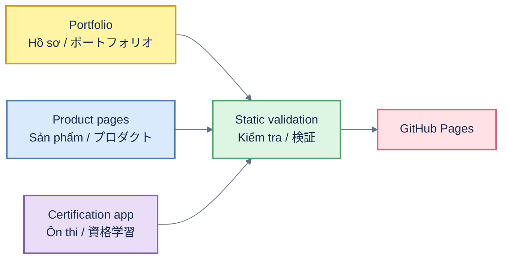

# thangldw.github.io

[English](#english) · [Tiếng Việt](#tiếng-việt) · [日本語](#日本語)

Personal portfolio, product pages and browser-based certification study tools, published at [thangldw.github.io](https://thangldw.github.io/).


```mermaid
%%{init: {"theme":"base","themeVariables":{"background":"#FFFFFF","fontFamily":"Arial, sans-serif","lineColor":"#667085","primaryTextColor":"#172B4D"}}}%%
flowchart LR
    A["Portfolio<br/>Hồ sơ / ポートフォリオ"]:::yellow
    B["Product pages<br/>Sản phẩm / プロダクト"]:::blue
    C["Certification app<br/>Ôn thi / 資格学習"]:::purple
    D["Static validation<br/>Kiểm tra / 検証"]:::green
    E["GitHub Pages"]:::pink
    A --> D
    B --> D
    C --> D
    D --> E
    classDef yellow fill:#FFF4A3,stroke:#C9A227,stroke-width:2px,color:#172B4D
    classDef blue fill:#D9EAFD,stroke:#4C78A8,stroke-width:2px,color:#172B4D
    classDef purple fill:#E9DDF7,stroke:#8064A2,stroke-width:2px,color:#172B4D
    classDef green fill:#DDF5E3,stroke:#4F9D69,stroke-width:2px,color:#172B4D
    classDef pink fill:#FFE1E6,stroke:#C96A7B,stroke-width:2px,color:#172B4D
```

## English

Active routes are `/`, `/apps/` and `/apps/cert/`. The site is static HTML, CSS and JavaScript. Certification source data lives in the private `thangldw/cert` repository; `apps/cert/` is generated release output and must not be edited manually.

```bash
python3 -m http.server 4173
python3 scripts/audit_ui_standards.py
python3 scripts/validate_site.py
node scripts/smoke_cert.mjs
```

## Tiếng Việt

Các route đang hoạt động là `/`, `/apps/` và `/apps/cert/`. Website dùng HTML, CSS và JavaScript tĩnh. Dữ liệu nguồn của ứng dụng ôn thi nằm trong repo private `thangldw/cert`; `apps/cert/` chỉ là artifact đã build và không được sửa thủ công.

Chạy các lệnh ở phần English để mở server local và kiểm tra toàn bộ website trước khi phát hành.

## 日本語

現在のルートは `/`、`/apps/`、`/apps/cert/` です。サイトは静的 HTML・CSS・JavaScript で構成されています。資格学習データの正規ソースは非公開リポジトリ `thangldw/cert` にあり、`apps/cert/` は生成済みリリース成果物です。手作業で編集しないでください。

ローカル配信と検証には English セクションのコマンドを使用します。
