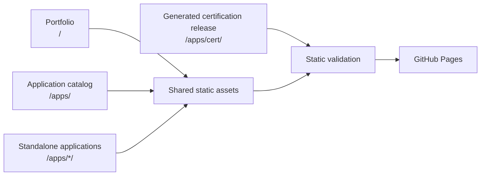

# thangldw.github.io

[English](#english) · [Tiếng Việt](#tiếng-việt) · [日本語](#日本語)

## English

### Overview

`thangldw.github.io` is a static personal portfolio and application catalog hosted on GitHub Pages. It presents selected product work, a Japan permanent-residency guide, and browser-based certification study tools.

- Production: [https://thangldw.github.io/](https://thangldw.github.io/)
- Runtime: static HTML, CSS, and JavaScript
- Hosting: GitHub Pages
- Build step: none
- Persistent backend: none

### Public routes

| Route | Purpose | Maintenance notes |
| --- | --- | --- |
| `/` | Portfolio and selected work | Primary public entry point |
| `/apps/` | Application catalog | Uses shared project-card data and styles |
| `/apps/japan-pr-guide/` | Japan permanent-residency guide | Standalone browser application |
| `/apps/cert/` | Certification study library | Generated release output; do not edit manually |
| `/404.html` | Custom not-found page | Must remain compatible with GitHub Pages |

### Architecture


```mermaid
flowchart LR
    A["Portfolio<br/>/"] --> D["Shared static assets"]
    B["Application catalog<br/>/apps/"] --> D
    C["Standalone applications<br/>/apps/*/"] --> D
    E["Generated certification release<br/>/apps/cert/"] --> F["Static validation"]
    D --> F
    F --> G["GitHub Pages"]
```

The repository deliberately avoids a framework and package-manager dependency. Shared design tokens, page structure, analytics, and catalog data are maintained as static assets. Validation scripts enforce the repository contract before deployment.

### Repository layout

```text
.
├── index.html                 # Portfolio home page
├── 404.html                   # GitHub Pages fallback
├── apps/
│   ├── index.html             # Application catalog
│   ├── japan-pr-guide/        # Japan permanent-residency guide
│   └── cert/                  # Generated certification release
├── assets/                    # Images and locally hosted fonts
├── css/                       # Design tokens, shared shell, and route styles
├── js/                        # Shared behavior, analytics, and catalog data
├── scripts/                   # Validation and browser smoke tests
├── robots.txt
└── sitemap.xml
```

### Prerequisites

- Python 3.10 or later
- Node.js 22 or later for the browser smoke test
- Google Chrome at its standard macOS path, or `CHROME_BIN` set to another Chrome-compatible executable

No dependency installation is required.

### Local development

Start a local static server from the repository root:

```bash
python3 -m http.server 4173
```

Open [http://localhost:4173/](http://localhost:4173/). Changes to HTML, CSS, and JavaScript are available after a browser refresh.

### Quality gates

Run all checks before publishing:

```bash
python3 scripts/audit_ui_standards.py
python3 scripts/validate_site.py
node scripts/smoke_cert.mjs
```

| Check | Coverage |
| --- | --- |
| `audit_ui_standards.py` | Shared UI contract, accessibility conventions, design tokens, and prohibited inline presentation patterns |
| `validate_site.py` | HTML parsing, local references, analytics inclusion, sitemap routes, canonical URLs, and social metadata |
| `smoke_cert.mjs` | Headless-Chrome behavior for the application catalog and certification workflows |

The smoke test starts isolated temporary servers and a temporary Chrome profile, then removes them when the run finishes.

### Content and change policy

- Treat `apps/cert/` as generated release output. Its source of truth is the private `thangldw/cert` repository.
- Make shared visual changes through `css/tokens.css`, `css/site-shell.css`, and the relevant shared component stylesheet whenever possible.
- Keep internal links root-relative so they behave consistently locally and on GitHub Pages.
- When adding a public route, update `sitemap.xml`, canonical metadata, Open Graph metadata, and the validation expectations together.
- Store fonts locally; the validation suite rejects external font dependencies.
- Keep `README.md` as the only durable Markdown document unless the validation policy is intentionally updated.
- Never commit secrets, credentials, private datasets, local metadata, or machine-specific paths.

### Release workflow

1. Update source files or synchronize generated certification artifacts from their source repository.
2. Run all quality gates.
3. Review `git diff` and confirm that generated files changed only when intended.
4. Commit with a focused message and push to the default branch.
5. Verify the production routes and social metadata after GitHub Pages finishes deploying.

History rewrites and force pushes are exceptional maintenance operations. Coordinate them before use because existing clones and pull-request references may retain obsolete commits.

### Contribution guidelines

Keep changes small, route-focused, and independently verifiable. Preserve the static, dependency-light architecture unless a documented requirement justifies changing it. Bug reports and proposals should include the affected route, reproduction steps, expected behavior, actual behavior, and browser or viewport details when relevant.

---

## Tiếng Việt

### Tổng quan

`thangldw.github.io` là portfolio cá nhân và danh mục ứng dụng tĩnh được phát hành bằng GitHub Pages. Website giới thiệu các sản phẩm tiêu biểu, cẩm nang thường trú tại Nhật Bản và các công cụ ôn thi chứng chỉ chạy trực tiếp trên trình duyệt.

- Môi trường production: [https://thangldw.github.io/](https://thangldw.github.io/)
- Runtime: HTML, CSS và JavaScript tĩnh
- Hosting: GitHub Pages
- Bước build: không có
- Backend lưu trữ lâu dài: không có

### Các route công khai

| Route | Mục đích | Lưu ý bảo trì |
| --- | --- | --- |
| `/` | Portfolio và các sản phẩm tiêu biểu | Điểm truy cập công khai chính |
| `/apps/` | Danh mục ứng dụng | Dùng chung dữ liệu và style của project card |
| `/apps/japan-pr-guide/` | Cẩm nang thường trú tại Nhật Bản | Ứng dụng trình duyệt độc lập |
| `/apps/cert/` | Thư viện ôn thi chứng chỉ | Artifact được sinh tự động; không sửa thủ công |
| `/404.html` | Trang không tìm thấy tùy chỉnh | Phải tương thích với GitHub Pages |

### Kiến trúc

Repository chủ động không sử dụng framework hoặc dependency từ package manager. Design token, cấu trúc trang, analytics và dữ liệu danh mục được quản lý dưới dạng tài nguyên tĩnh dùng chung. Các script kiểm tra bảo đảm repository tuân thủ hợp đồng kỹ thuật trước khi triển khai.

```text
.
├── index.html                 # Trang portfolio chính
├── 404.html                   # Trang dự phòng của GitHub Pages
├── apps/
│   ├── index.html             # Danh mục ứng dụng
│   ├── japan-pr-guide/        # Cẩm nang thường trú tại Nhật Bản
│   └── cert/                  # Bản phát hành chứng chỉ được sinh tự động
├── assets/                    # Hình ảnh và font được lưu cục bộ
├── css/                       # Design token, site shell và style theo route
├── js/                        # Hành vi dùng chung, analytics và dữ liệu danh mục
├── scripts/                   # Kiểm tra tĩnh và browser smoke test
├── robots.txt
└── sitemap.xml
```

### Điều kiện cần

- Python 3.10 trở lên
- Node.js 22 trở lên để chạy browser smoke test
- Google Chrome tại đường dẫn macOS mặc định, hoặc biến `CHROME_BIN` trỏ đến executable tương thích với Chrome

Không cần cài dependency.

### Phát triển local

Khởi động static server từ thư mục gốc của repository:

```bash
python3 -m http.server 4173
```

Mở [http://localhost:4173/](http://localhost:4173/). Các thay đổi HTML, CSS và JavaScript sẽ có hiệu lực sau khi refresh trình duyệt.

### Cổng kiểm soát chất lượng

Chạy toàn bộ kiểm tra trước khi phát hành:

```bash
python3 scripts/audit_ui_standards.py
python3 scripts/validate_site.py
node scripts/smoke_cert.mjs
```

| Kiểm tra | Phạm vi |
| --- | --- |
| `audit_ui_standards.py` | Hợp đồng UI dùng chung, quy ước accessibility, design token và các kiểu trình bày inline bị cấm |
| `validate_site.py` | Phân tích HTML, liên kết nội bộ, analytics, sitemap, canonical URL và social metadata |
| `smoke_cert.mjs` | Hành vi trên Headless Chrome của danh mục ứng dụng và luồng ôn thi chứng chỉ |

Smoke test tự khởi động các server và Chrome profile tạm biệt lập, sau đó xóa chúng khi hoàn tất.

### Quy tắc nội dung và thay đổi

- Xem `apps/cert/` là artifact phát hành được sinh tự động. Nguồn chuẩn nằm trong repository private `thangldw/cert`.
- Ưu tiên thực hiện thay đổi giao diện dùng chung qua `css/tokens.css`, `css/site-shell.css` và stylesheet component liên quan.
- Dùng liên kết nội bộ bắt đầu từ root để hành vi nhất quán giữa local và GitHub Pages.
- Khi thêm route công khai, phải cập nhật đồng thời `sitemap.xml`, canonical metadata, Open Graph metadata và các điều kiện validation.
- Lưu font trong repository; bộ validation không cho phép dependency font bên ngoài.
- Chỉ giữ `README.md` làm tài liệu Markdown lâu dài, trừ khi chủ động cập nhật chính sách validation.
- Không commit secret, credential, dữ liệu private, metadata cục bộ hoặc đường dẫn phụ thuộc máy.

### Quy trình phát hành

1. Cập nhật source hoặc đồng bộ artifact chứng chỉ từ repository nguồn.
2. Chạy toàn bộ cổng kiểm soát chất lượng.
3. Kiểm tra `git diff` và xác nhận file sinh tự động chỉ thay đổi khi có chủ đích.
4. Commit với nội dung tập trung và push lên default branch.
5. Sau khi GitHub Pages triển khai xong, kiểm tra các route production và social metadata.

Rewrite lịch sử và force-push chỉ dành cho bảo trì ngoại lệ. Cần phối hợp trước khi thực hiện vì clone cũ và tham chiếu pull request có thể tiếp tục giữ commit lỗi thời.

### Hướng dẫn đóng góp

Giữ mỗi thay đổi nhỏ, tập trung vào một route và có thể kiểm chứng độc lập. Duy trì kiến trúc tĩnh, ít dependency, trừ khi có yêu cầu được ghi nhận rõ ràng. Báo lỗi và đề xuất nên nêu route bị ảnh hưởng, cách tái hiện, kết quả mong đợi, kết quả thực tế và thông tin trình duyệt hoặc viewport nếu có liên quan.

---

## 日本語

### 概要

`thangldw.github.io` は、GitHub Pages で公開している静的な個人ポートフォリオ兼アプリケーションカタログです。主なプロダクト、日本の永住権ガイド、ブラウザ上で動作する資格学習ツールを掲載しています。

- 本番環境: [https://thangldw.github.io/](https://thangldw.github.io/)
- ランタイム: 静的 HTML、CSS、JavaScript
- ホスティング: GitHub Pages
- ビルド工程: なし
- 永続バックエンド: なし

### 公開ルート

| ルート | 目的 | 保守上の注意 |
| --- | --- | --- |
| `/` | ポートフォリオと主な実績 | 主要な公開エントリーポイント |
| `/apps/` | アプリケーションカタログ | プロジェクトカードのデータとスタイルを共有 |
| `/apps/japan-pr-guide/` | 日本の永住権ガイド | 独立したブラウザアプリケーション |
| `/apps/cert/` | 資格学習ライブラリ | 自動生成されたリリース成果物。手作業で編集しないこと |
| `/404.html` | カスタム Not Found ページ | GitHub Pages との互換性を維持すること |

### アーキテクチャ

このリポジトリは、意図的にフレームワークやパッケージマネージャー由来の依存関係を使用していません。デザイントークン、ページ構造、アクセス解析、カタログデータは共有の静的アセットとして管理します。検証スクリプトにより、デプロイ前にリポジトリの技術的な規約を確認します。

```text
.
├── index.html                 # ポートフォリオのトップページ
├── 404.html                   # GitHub Pages のフォールバックページ
├── apps/
│   ├── index.html             # アプリケーションカタログ
│   ├── japan-pr-guide/        # 日本の永住権ガイド
│   └── cert/                  # 自動生成された資格学習リリース
├── assets/                    # 画像とローカル配信フォント
├── css/                       # デザイントークン、共通シェル、ルート別スタイル
├── js/                        # 共通動作、アクセス解析、カタログデータ
├── scripts/                   # 静的検証とブラウザスモークテスト
├── robots.txt
└── sitemap.xml
```

### 前提条件

- Python 3.10 以降
- ブラウザスモークテスト用の Node.js 22 以降
- macOS の標準パスにある Google Chrome、または Chrome 互換実行ファイルを指定した `CHROME_BIN`

依存パッケージのインストールは不要です。

### ローカル開発

リポジトリのルートで静的サーバーを起動します。

```bash
python3 -m http.server 4173
```

[http://localhost:4173/](http://localhost:4173/) を開きます。HTML、CSS、JavaScript の変更は、ブラウザを更新すると反映されます。

### 品質ゲート

公開前にすべての検証を実行します。

```bash
python3 scripts/audit_ui_standards.py
python3 scripts/validate_site.py
node scripts/smoke_cert.mjs
```

| 検証 | 対象 |
| --- | --- |
| `audit_ui_standards.py` | 共通 UI 規約、アクセシビリティ規約、デザイントークン、禁止されているインライン表現 |
| `validate_site.py` | HTML 解析、ローカル参照、アクセス解析、サイトマップ、canonical URL、ソーシャルメタデータ |
| `smoke_cert.mjs` | Headless Chrome 上のアプリケーションカタログと資格学習フロー |

スモークテストは分離された一時サーバーと Chrome プロファイルを起動し、完了後に削除します。

### コンテンツと変更の方針

- `apps/cert/` は自動生成されたリリース成果物として扱います。正規のソースは非公開リポジトリ `thangldw/cert` にあります。
- 共通の見た目を変更する場合は、可能な限り `css/tokens.css`、`css/site-shell.css`、該当する共有コンポーネントのスタイルシートを使用します。
- ローカル環境と GitHub Pages で同じ動作になるように、内部リンクはルート相対パスにします。
- 公開ルートを追加する際は、`sitemap.xml`、canonical メタデータ、Open Graph メタデータ、検証条件を同時に更新します。
- フォントはリポジトリ内で配信します。検証スイートは外部フォントへの依存を許可しません。
- 検証ポリシーを意図的に変更しない限り、永続的な Markdown ドキュメントは `README.md` のみにします。
- シークレット、認証情報、非公開データセット、ローカルメタデータ、マシン固有のパスをコミットしないでください。

### リリース手順

1. ソースファイルを更新するか、資格学習の生成済み成果物をソースリポジトリから同期します。
2. すべての品質ゲートを実行します。
3. `git diff` を確認し、自動生成ファイルが意図した場合にのみ変更されていることを確認します。
4. 変更内容を明確に表すメッセージでコミットし、デフォルトブランチへプッシュします。
5. GitHub Pages のデプロイ完了後、本番ルートとソーシャルメタデータを確認します。

履歴の書き換えと force-push は例外的な保守作業です。既存のクローンや pull request の参照に古いコミットが残る可能性があるため、実行前に関係者と調整してください。

### コントリビューションガイド

変更は小さく保ち、対象ルートを明確にし、単独で検証できるようにしてください。明文化された要件がない限り、静的で依存関係の少ないアーキテクチャを維持します。不具合報告や提案には、対象ルート、再現手順、期待する動作、実際の動作、および必要に応じてブラウザやビューポートの情報を含めてください。
