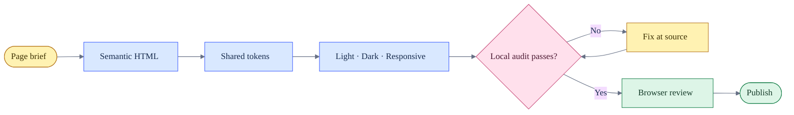

# UI Standard 1.0 / Tiêu chuẩn UI 1.0 / UI標準 1.0

**Status:** Required / Bắt buộc / 必須  
**Version:** 1.0 — 2026-07-22  
**Scope:** Every public HTML page and app in this repository.

This file is the source of truth for new pages and for any legacy page that is edited. It complements the automated gate in `scripts/audit_ui_standards.py`.

Tài liệu này là nguồn quy chuẩn duy nhất cho trang mới và cho mọi trang cũ khi được chỉnh sửa. Quy chuẩn được kiểm tra tự động bởi `scripts/audit_ui_standards.py`.

この文書は、新規ページおよび変更対象の既存ページに対する唯一の UI 基準です。`scripts/audit_ui_standards.py` が自動検証します。

## Delivery flow / Luồng phát hành / リリースフロー



## Non-negotiable contract / Hợp đồng bắt buộc / 必須ルール

| Area | VI | EN | 日本語 |
|---|---|---|---|
| Structure | Một `main`, một `h1` trong source, thứ bậc heading liên tục | One `main`, one source `h1`, sequential heading hierarchy | `main` と source 上の `h1` は各1つ、見出し階層を維持 |
| Language | `html[lang]`; dùng `lang="ja"` cho đoạn tiếng Nhật trong UI Việt/Anh | Set `html[lang]`; mark Japanese fragments with `lang="ja"` | `html[lang]` を設定し、日本語部分は `lang="ja"` を付与 |
| Theme | Light và dark phải bao phủ nền, surface, text, border, hover, focus, disabled, success, error | Light and dark must cover every component state | ライト・ダーク両方で全状態を定義 |
| Responsive | Không tràn ngang document tại 390 px; kiểm tra thêm 680, 1280 và 1440 px | No document overflow at 390 px; also test 680, 1280 and 1440 px | 390 px で横スクロール禁止。680、1280、1440 px も確認 |
| Controls | Radius 8 px; answer/choice 10 px; target 40 px, compact secondary control tối thiểu 34 px | 8 px controls; 10 px answers; 40 px target, 34 px only for compact secondary controls | 操作部品 8 px、回答 10 px、通常 40 px、補助操作のみ 34 px |
| Keyboard | Mọi control dùng được bằng bàn phím và có `:focus-visible` rõ | Every control is keyboard operable with visible focus | 全操作をキーボード対応し、focus を明示 |
| Metadata | Charset, viewport, title, description, canonical, OG và Twitter metadata | Charset, viewport, title, description, canonical, OG and Twitter metadata | charset、viewport、title、description、canonical、OG、Twitter を必須化 |
| Assets | Font/icon phải local; runtime CDN cần lý do, fallback và error state; ảnh có `alt`; icon trang trí có `aria-hidden="true"` | Fonts/icons stay local; runtime CDNs need a reason, fallback and error state; images need `alt`; decorative icons are hidden | font/icon はローカル。runtime CDN は理由・fallback・error state が必須。画像 `alt`、装飾アイコンは非表示化 |

## Visual foundation / Nền tảng giao diện / ビジュアル基盤

- Light canvas: `#fbfaf6` through `--bg` or `--portfolio-bg`; never reintroduce `#f3f0e8`.
- Dark canvas: `#11130f`; component colors must come from `css/tokens.css` or `css/app-design-system.css`.
- UI font: `--font-ui`; Japanese text: `--font-jp-sans`; mono is reserved for metadata, labels and code.
- Default content width: `--portfolio-content: 1328px`; a page may choose a narrower task-specific container.
- Spacing uses the shared scale in `css/tokens.css`. New CSS must not invent a parallel token system.
- New interactive CSS must not use ID selectors or `!important`. Compatibility layers may keep documented exceptions.
- No shadows unless they communicate elevation. Borders and surface contrast remain the default separation method.

VI: Màu, font, spacing và radius phải đi qua token dùng chung. EN: Colors, type, spacing and radii must use shared tokens. 日本語: 色、書体、余白、角丸は共通トークンを使用します。

## Stylesheet order / Thứ tự CSS / CSS 読み込み順

```html
<link rel="stylesheet" href="/css/reset.css">
<link rel="stylesheet" href="/css/tokens.css?v=YYYYMMDD">
<link rel="stylesheet" href="/path/to/app.css?v=YYYYMMDD">
<link rel="stylesheet" href="/css/app-footer.css?v=YYYYMMDD">
<link rel="stylesheet" href="/css/app-design-system.css?v=YYYYMMDD">
<!-- Language apps only -->
<link rel="stylesheet" href="/css/language-app-readable.css?v=YYYYMMDD">
```

The last layer owns cross-project consistency. A page-specific file owns layout and product-specific components. New pages must not copy entire blocks from another app.

Lớp cuối giữ tính đồng nhất; CSS riêng chỉ giữ layout và component đặc thù. Trang mới không copy nguyên khối CSS từ app khác.

最終レイヤーが全体整合性を担い、アプリ CSS は固有レイアウトのみを担当します。既存アプリの CSS 一式を複製しません。

## HTML and accessibility / HTML và accessibility / HTML・アクセシビリティ

- Use semantic landmarks: `header`, `nav`, one `main`, and `footer` where applicable.
- Add a skip link on navigation-heavy pages.
- Every icon-only button needs `type="button"` and an accessible name.
- Every input needs a visible `label` or `aria-label`; placeholder text is not a label.
- External links opened with `target="_blank"` require `rel="noopener"`.
- Tabs require a named `role="tablist"`; every tab needs `id`, `aria-selected`, `aria-controls`, roving `tabindex`; every panel needs `aria-labelledby`.
- Use `aria-pressed` for filters/toggles that do not replace a panel. Do not call ordinary navigation a tablist.
- Dynamic content must preserve an accessible source fallback; JavaScript-rendered hubs include an `h1` fallback for no-script parsing.
- Respect `prefers-reduced-motion`; motion must not be required to understand state.

VI: ARIA chỉ bổ sung cho HTML semantic, không thay thế semantic. EN: ARIA supplements semantic HTML; it does not replace it. 日本語: ARIA はセマンティック HTML を補完するもので、代替ではありません。

## Component states / Trạng thái component / コンポーネント状態

Every interactive component must define default, hover, focus-visible, active/selected, disabled, loading and error states when those states can occur.

Mọi component tương tác phải định nghĩa default, hover, focus-visible, active/selected, disabled, loading và error nếu trạng thái đó có thể xuất hiện.

各操作コンポーネントは、必要に応じて default、hover、focus-visible、active/selected、disabled、loading、error を定義します。

## New-page checklist / Checklist trang mới / 新規ページ確認

1. Add the canonical route and social metadata; register the route in `sitemap.xml`.
2. Reuse `tokens.css`, the shared design system and existing icon assets.
3. Add semantic landmarks, one source `h1`, labels and keyboard behavior.
4. Verify light/dark at 390, 680, 1280 and 1440 px.
5. Check long Vietnamese, English and Japanese strings, empty/loading/error states and content zoom.
6. Run both local gates and review the diff:

```bash
python3 scripts/audit_ui_standards.py
python3 scripts/validate_site.py
git diff --check
```

7. Capture representative browser evidence and record material exceptions in `design-qa.md`.

## Legacy policy / Chính sách code cũ / 既存コード方針

Existing single-file learning apps may retain inline data and compatibility CSS until edited. New inline presentation styles and inline event handlers are prohibited. When a legacy surface is touched, migrate the affected component to shared tokens and unobtrusive event listeners without rewriting unrelated study data.

Các app học cũ có thể giữ dữ liệu inline và CSS tương thích cho tới khi được sửa; code mới không được thêm inline style/event. Khi chạm vào component cũ, refactor đúng phạm vi sang token và event listener dùng chung.

既存の単一 HTML 学習アプリは変更対象になるまで互換コードを保持できます。新規の inline style/event は禁止し、変更箇所から段階的に共通化します。

## Governance / Quản trị / 運用

- Change this standard and the automated audit in the same commit.
- A failing UI standards audit blocks release.
- Exceptions require a reason, owner, expiry condition and a note in `design-qa.md`.
- Standard version changes only when the contract changes, not for ordinary app CSS updates.
