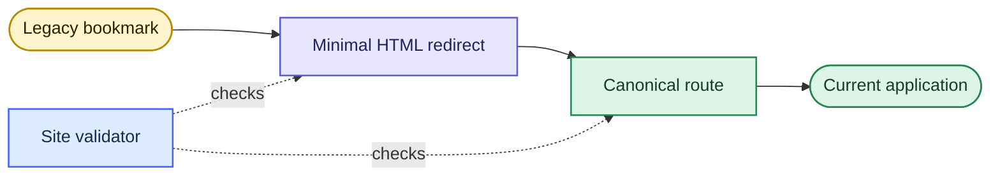
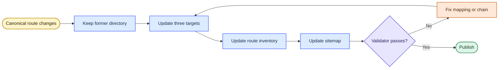

# JLPT route compatibility

Canonical names replaced several short or ambiguous JLPT paths. Each legacy directory contains one minimal redirect page—no duplicated application code, scripts, styles, or data.

## Compatibility flow

## Route inventory

| Previous URL | Canonical URL | Application |
|---|---|---|
| `/apps/flashcard-n1/` | `/apps/n1-grammar-flashcards/` | Grammar Flashcards |
| `/apps/kanji-n1/` | `/apps/n1-kanji-analysis/` | Kanji Analysis |
| `/apps/n1-dokkai/` | `/apps/n1-reading-75/` | Reading — 75 Passages |
| `/apps/n1-exam-vocab/` | `/apps/n1-vocabulary-exams/` | Vocabulary Exams |
| `/apps/n1-goi-tabs/` | `/apps/n1-vocabulary-tabs/` | Vocabulary Tabs |
| `/apps/n1-grammar/` | `/apps/n1-grammar-exams/` | Grammar Exams |
| `/apps/n1-mondai2/` | `/apps/n1-vocabulary-context/` | Context Vocabulary — 問題2 |
| `/apps/n1-mondai3/` | `/apps/n1-vocabulary-paraphrase/` | Paraphrase Vocabulary — 問題3 |
| `/apps/n1-mondai4/` | `/apps/n1-vocabulary-tabs/` | Vocabulary Tabs |
| `/apps/n1-mondai6/` | `/apps/n1-grammar-sentence-order/` | Sentence Ordering — 問題6 |
| `/apps/n1-mondai6-drill/` | `/apps/n1-grammar-sentence-order-drill/` | Sentence Ordering Drill |
| `/apps/n1-mondai9/` | `/apps/n1-reading-mondai9/` | Reading Practice — 問題9 |
| `/apps/n1-tango/` | `/apps/n1-vocabulary-tabs/` | Vocabulary Tabs |
| `/apps/n1-vocab/` | `/apps/n1-kanji-collocations/` | Kanji & Collocations |

## Redirect invariants

Every legacy page must contain exactly three route references:

1. a zero-delay refresh target;
2. a canonical link;
3. a visible fallback anchor.

All three references point directly to the canonical route. Redirect pages do not load analytics and canonical apps do not redirect again.

## Change procedure

Run `python3 scripts/validate_site.py` after every route change. The validator compares this table with the redirect pages and rejects undocumented mappings, missing targets, and redirect chains.
