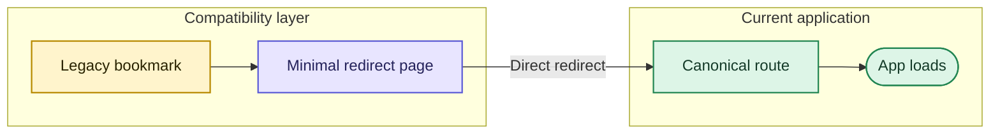

# JLPT URL redirects

Canonical app names replaced several short or ambiguous JLPT paths. Each old directory now contains only a direct browser redirect, keeping existing bookmarks valid without retaining duplicate application code.

## Redirect flow

## Complete route inventory

| Previous URL | Canonical URL | Current application |
|---|---|---|
| `/apps/flashcard-n1/` | `/apps/n1-grammar-flashcards/` | Grammar Flashcards |
| `/apps/kanji-n1/` | `/apps/n1-kanji-analysis/` | Kanji Analysis |
| `/apps/n1-dokkai/` | `/apps/n1-reading-75/` | Reading — 75 Passages |
| `/apps/n1-exam-vocab/` | `/apps/n1-vocabulary-exams/` | Vocabulary Exams |
| `/apps/n1-goi-tabs/` | `/apps/n1-vocabulary-tabs/` | Vocabulary Tabs |
| `/apps/n1-grammar/` | `/apps/n1-grammar-exams/` | Grammar Exams |
| `/apps/n1-mondai2/` | `/apps/n1-vocabulary-context/` | Context Vocabulary — 問題2 |
| `/apps/n1-mondai3/` | `/apps/n1-vocabulary-paraphrase/` | Paraphrase Vocabulary — 問題3 |
| `/apps/n1-mondai4/` | `/apps/n1-vocabulary-tabs/` | Vocabulary Tabs |
| `/apps/n1-mondai6/` | `/apps/n1-grammar-sentence-order/` | Sentence Ordering — 問題6 |
| `/apps/n1-mondai6-drill/` | `/apps/n1-grammar-sentence-order-drill/` | Sentence Ordering Drill |
| `/apps/n1-mondai9/` | `/apps/n1-reading-mondai9/` | Reading Practice — 問題9 |
| `/apps/n1-tango/` | `/apps/n1-vocabulary-tabs/` | Vocabulary Tabs |
| `/apps/n1-vocab/` | `/apps/n1-kanji-collocations/` | Kanji & Collocations |

## Change procedure

When a canonical route changes:

1. keep the former directory as a minimal redirect;
2. point its refresh target, canonical link, and fallback anchor directly to the current route;
3. update this inventory and `sitemap.xml`;
4. run `python3 scripts/validate_site.py`;
5. avoid redirect chains and duplicate app implementations.

The validator compares this table with every HTML refresh redirect, so undocumented or stale mappings fail validation.
