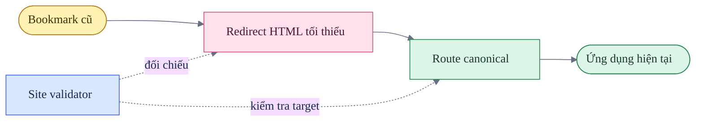
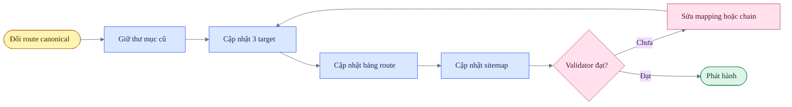

# URL migration cho JLPT N1

Tài liệu này là nguồn sự thật cho các route JLPT cũ. Mỗi thư mục legacy chỉ chứa một trang redirect tối thiểu; mã ứng dụng, CSS và dữ liệu chỉ tồn tại ở route canonical.

## Luồng tương thích



## Bảng route

> Hai cột URL dưới đây được `scripts/validate_site.py` đọc tự động. Giữ nguyên định dạng backtick và dấu `/` cuối route.

| Previous URL | Canonical URL | Application |
|---|---|---|
| `/apps/flashcard-n1/` | `/apps/n1-grammar-flashcards/` | Grammar Flashcards |
| `/apps/kanji-n1/` | `/apps/n1-kanji-analysis/` | Kanji Analysis |
| `/apps/n1-dokkai/` | `/apps/n1-reading-75/` | Reading — 75 Passages |
| `/apps/n1-exam-vocab/` | `/apps/n1-vocabulary-exams/` | Vocabulary Exams |
| `/apps/n1-goi-tabs/` | `/apps/n1-vocabulary-tabs/` | Vocabulary Tabs |
| `/apps/n1-grammar/` | `/apps/n1-grammar-exams/` | Grammar Exams |
| `/apps/n1-mondai2/` | `/apps/n1-vocabulary-context/` | Context Vocabulary — 問題2 |
| `/apps/n1-mondai3/` | `/apps/n1-vocabulary-paraphrase/` | Paraphrase Vocabulary — 問題3 |
| `/apps/n1-mondai4/` | `/apps/n1-vocabulary-tabs/` | Vocabulary Tabs |
| `/apps/n1-mondai6/` | `/apps/n1-grammar-sentence-order/` | Sentence Ordering — 問題6 |
| `/apps/n1-mondai6-drill/` | `/apps/n1-grammar-sentence-order-drill/` | Sentence Ordering Drill |
| `/apps/n1-mondai9/` | `/apps/n1-reading-mondai9/` | Reading Practice — 問題9 |
| `/apps/n1-tango/` | `/apps/n1-vocabulary-tabs/` | Vocabulary Tabs |
| `/apps/n1-vocab/` | `/apps/n1-kanji-collocations/` | Kanji & Collocations |

## Invariant của redirect

Mỗi redirect page phải có đúng ba tham chiếu cùng trỏ trực tiếp tới route canonical:

1. `meta refresh` với thời gian bằng 0;
2. `link rel="canonical"`;
3. fallback anchor hiển thị cho người dùng.

Redirect page không tải analytics. Route canonical không được redirect thêm lần nữa.

## Quy trình thay đổi route



Sau mọi thay đổi route, chạy:

```bash
python3 scripts/validate_site.py
```

Validator sẽ từ chối redirect không được ghi nhận, target không tồn tại, mapping thừa hoặc redirect chain.
