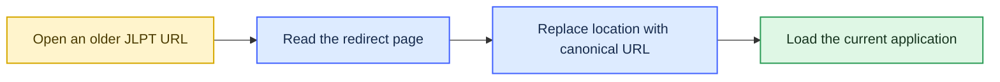

# Canonical JLPT routes

The JLPT tools use descriptive, stable URLs. Older paths are retained only as lightweight browser redirects so bookmarks and previously shared links continue to work.

## Redirect behavior

## Route inventory

| Previous URL | Canonical URL | Application title |
|---|---|---|
| `/apps/flashcard-n1/` | `/apps/n1-grammar-flashcards/` | JLPT N1 Grammar Flashcards |
| `/apps/n1-dokkai/` | `/apps/n1-reading-75/` | JLPT N1 Reading — 75 Passages |
| `/apps/n1-exam-vocab/` | `/apps/n1-vocabulary-exams/` | JLPT N1 Vocabulary Exams 2010–2025 |
| `/apps/n1-goi-tabs/` | `/apps/n1-vocabulary-tabs/` | JLPT N1 Vocabulary Tabs |
| `/apps/n1-grammar/` | `/apps/n1-grammar-exams/` | JLPT N1 Grammar Exams 2010–2024 |
| `/apps/n1-mondai2/` | `/apps/n1-vocabulary-context/` | JLPT N1 Context Vocabulary — 問題2 |
| `/apps/n1-mondai3/` | `/apps/n1-vocabulary-paraphrase/` | JLPT N1 Paraphrase Vocabulary — 問題3 |
| `/apps/n1-mondai6/` | `/apps/n1-grammar-sentence-order/` | JLPT N1 Sentence Ordering — 文の文法② |
| `/apps/n1-mondai6-drill/` | `/apps/n1-grammar-sentence-order-drill/` | JLPT N1 Sentence Ordering Drill — 問題6 |
| `/apps/n1-mondai9/` | `/apps/n1-reading-mondai9/` | JLPT N1 Reading Practice — 問題9 |

## Maintenance rules

When a canonical path changes:

1. keep the previous directory with a minimal redirect page;
2. point its canonical metadata and redirect target to the new route;
3. update this table and `sitemap.xml`;
4. run `python3 scripts/validate_site.py`;
5. do not create redirect chains—every previous URL must point directly to the current route.
