# BJT Study — Design QA

**Trạng thái:** đạt

**Xác nhận gần nhất:** 2026-07-22

**Phạm vi:** desktop 1440 × 1024, mobile 390 × 844, light và dark

## Luồng chính

```mermaid
%%{init: {"theme":"base","flowchart":{"curve":"linear","nodeSpacing":34,"rankSpacing":44},"themeVariables":{"fontFamily":"Inter, Arial, sans-serif","fontSize":"14px","lineColor":"#5F6B7A","primaryTextColor":"#1F2937","clusterBkg":"#FFFFFF","clusterBorder":"#CBD5E1"}}}%%
flowchart LR
  Path(["Lộ trình"]) --> Subject{"Chọn nội dung"}
  Subject --> Vocabulary["Từ vựng"]
  Subject --> Grammar["Ngữ pháp"]
  Vocabulary --> Setup["5 · 10 · 20 câu"]
  Grammar --> Setup
  Setup --> Timed["30 giây / câu"]
  Timed --> Feedback["Đáp án · giải thích"]
  Feedback --> Result["Kết quả phiên"]
  Feedback --> Review["Ôn sai"]
  Result --> History[("IndexedDB")]

  classDef stickyYellow fill:#FFF3B0,stroke:#C99700,color:#3D2F00,stroke-width:1.5px;
  classDef stickyBlue fill:#DCEBFF,stroke:#4C6FFF,color:#172B4D,stroke-width:1.5px;
  classDef stickyPink fill:#FFE1EC,stroke:#D65A87,color:#4A1730,stroke-width:1.5px;
  classDef stickyGreen fill:#DFF5E8,stroke:#2D9D62,color:#153B29,stroke-width:1.5px;
  class Path stickyYellow;
  class Vocabulary,Grammar,Timed,Feedback stickyBlue;
  class Subject,Setup stickyPink;
  class Result,Review,History stickyGreen;
  linkStyle default stroke:#5F6B7A,stroke-width:1.5px;
```

## Coverage

| Khu vực | Điều đã xác nhận | Kết quả |
|---|---|---|
| Điều hướng | Sidebar đồng nhất với JLPT, mobile thu gọn, không tràn ngang | Đạt |
| Từ vựng | 1.565 thuật ngữ, tìm kiếm, 30 nhóm ý nghĩa và phân tích Kanji | Đạt |
| Ngữ pháp | 84 mẫu; ý nghĩa, giải thích tiếng Việt và ví dụ được tách trường | Đạt |
| Luyện tập | Scope từ vựng, ngữ pháp hoặc tổng hợp; 5, 10 hoặc 20 câu | Đạt |
| Timer | Tự nộp ở 0 giây và hiển thị trạng thái hết giờ | Đạt |
| Feedback | Trạng thái đúng/sai, đáp án, ví dụ và giải thích nhất quán | Đạt |
| Ôn sai | Giữ câu sai đến khi trả lời đúng trong lượt ôn | Đạt |
| Lịch sử | Phiên, từng câu, thời lượng, mastery và backup JSON | Đạt |
| Theme | Warm paper ở light; warm charcoal ở dark | Đạt |
| Runtime | Không có lỗi console trong các luồng đã kiểm tra | Đạt |

## Dữ liệu và persistence

- Tiến độ và lịch sử học được lưu trong IndexedDB.
- Các key tiến độ BJT cũ trong `localStorage` bị xóa một lần và không được nhập lại.
- `localStorage` chỉ giữ lựa chọn `theme`.
- Người học có thể xuất và nhập lịch sử bằng JSON; chưa có tài khoản hoặc đồng bộ nhiều thiết bị.

## Hồi quy đã kiểm tra

- [x] Mở các tab Từ vựng và Ngữ pháp.
- [x] Tìm kiếm và mở chi tiết một thuật ngữ.
- [x] Chạy lượt 5 câu, gồm đáp án đúng, sai và hết giờ.
- [x] Hoàn thành phiên và mở lại từng câu trong Lịch sử.
- [x] Tải lại trang và xác nhận tiến độ vẫn tồn tại.
- [x] Chuyển light/dark và kiểm tra selected-answer state.
- [x] Xác nhận mobile không có horizontal overflow.

## Giới hạn

- Đây là chương trình luyện tập từ kho dữ liệu cung cấp, không phải đề BJT chính thức.
- Speech phụ thuộc Web Speech API và voice tiếng Nhật trên thiết bị.
- Cloud sync chỉ phù hợp khi có tài khoản, consent và chính sách dữ liệu rõ ràng.

Không còn finding P0, P1 hoặc P2 trong phạm vi đã kiểm tra.

**final result: passed**
