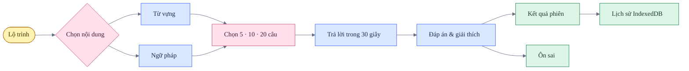

# BJT Study — Design QA

**Trạng thái:** đạt

**Lần xác nhận:** 2026-07-21

**Phạm vi:** desktop 1440 × 1024, mobile 390 × 844, giao diện sáng và tối

## Luồng được kiểm tra

## Kết quả

| Khu vực | Tiêu chí | Kết quả |
|---|---|---|
| Điều hướng | Sidebar thống nhất với JLPT, mobile thu gọn, không tràn ngang | Đạt |
| Từ vựng | 1.565 thuật ngữ, tìm kiếm, 30 nhóm ý nghĩa, phân tích Kanji | Đạt |
| Ngữ pháp | 84 mẫu, ý nghĩa, giải thích tiếng Việt và ví dụ tách biệt | Đạt |
| Luyện tập | Scope từ vựng/ngữ pháp/tổng hợp; 5, 10 hoặc 20 câu | Đạt |
| Timer | Tự nộp ở 0 giây và hiển thị trạng thái hết giờ | Đạt |
| Feedback | Đúng/sai, đáp án, ví dụ và thông tin học tập không lẫn trường | Đạt |
| Ôn sai | Câu sai được giữ cho tới khi trả lời đúng trong lượt ôn | Đạt |
| Lịch sử | Phiên, từng câu, thời lượng, mastery và export/import JSON | Đạt |
| Theme | Warm paper ở light mode; warm charcoal ở dark mode | Đạt |
| Console | Không có lỗi trong các luồng đã kiểm tra | Đạt |

## Trạng thái dữ liệu

- Tiến độ mới và lịch sử học được lưu trong IndexedDB.
- Các key tiến độ BJT cũ trong `localStorage` bị xóa một lần và không được nhập lại.
- `localStorage` chỉ giữ lựa chọn `theme`.
- Dữ liệu học có thể xuất và nhập bằng JSON; chưa có đồng bộ tài khoản hoặc nhiều thiết bị.

## Checklist hồi quy

- [x] Mở cả ba tab của Từ vựng và Ngữ pháp.
- [x] Tìm kiếm và mở chi tiết một thuật ngữ.
- [x] Bắt đầu lượt 5 câu và kiểm tra bộ đếm `Đúng / tổng`.
- [x] Kiểm tra đáp án đúng, sai và hết giờ.
- [x] Hoàn thành phiên và mở lại từng câu trong Lịch sử.
- [x] Tải lại trang và xác nhận tiến độ mới vẫn tồn tại.
- [x] Chuyển sáng/tối và kiểm tra selected-answer state.
- [x] Kiểm tra mobile không có horizontal overflow.

## Giới hạn đã biết

- Đây là chương trình luyện tập từ kho dữ liệu cung cấp, không phải đề BJT chính thức.
- Speech phụ thuộc Web Speech API và voice tiếng Nhật được cài trên thiết bị.
- Đồng bộ cloud sẽ chỉ được thêm khi có hệ thống tài khoản và chính sách dữ liệu phù hợp.
