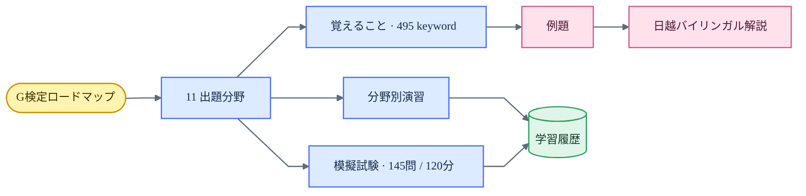

# G検定 Study Program — Design QA

**Trạng thái:** đạt

**Xác nhận gần nhất:** 2026-07-22

**Phạm vi:** 390, 680, 1280 và 1440 px; light/dark; desktop/mobile

## Luồng học

## Nguồn đối chiếu

- Luồng học và layout từ `/apps/jlpt-n1/`.
- Các ảnh lỗi do người dùng cung cấp trong quá trình triển khai.
- `JDLA_G検定シラバス2024_v1.4.pdf` cho phạm vi 11 lĩnh vực và keyword.
- Ảnh QA tạm không được commit theo chính sách bằng chứng của repository.

## Coverage giao diện

| Bề mặt | Điều đã xác nhận | Kết quả |
|---|---|---|
| Ngôn ngữ | UI và câu hỏi bằng tiếng Nhật; chỉ phần giải thích sau đáp án dùng Nhật–Việt | Đạt |
| Roadmap | 11 thẻ, đúng thứ tự 01–11, có trạng thái và progressbar semantic | Đạt |
| Topic guide | `この分野で覚えること`, keyword Nhật và `例題` | Đạt |
| Filter/search | `出題分野`, `基礎`/`標準`/`応用`; search chỉ có một border | Đạt |
| Practice | Chọn đáp án, đúng/sai, timeout, quay lại đúng màn nguồn | Đạt |
| Mock exam | 145 câu trong 120 phút | Đạt |
| Theme | Warm paper/charcoal; interaction accent `var(--accent, #c84d24)` | Đạt |
| Responsive | Grid 3 cột ≥1181 px, 2 cột 821–1180 px, 1 cột ≤820 px | Đạt |
| Accessibility | Một `main`, một `h1`, skip link, label, focus và reduced motion | Đạt |

## Những lỗi đã khép lại

1. Search từng có hai khung lồng nhau; input con hiện transparent và focus nằm trên wrapper.
2. “Ngân hàng câu hỏi” đã được thay bằng 11 chủ đề gồm nội dung cần nhớ, keyword và câu minh họa.
3. Topic, difficulty và toàn bộ navigation đã được chuyển sang tiếng Nhật.
4. Giải thích Nhật–Việt chỉ xuất hiện sau khi người học chọn đáp án.
5. Metric, CTA, active state và focus ring đã thống nhất về `var(--accent, #c84d24)`.
6. Relevance scoring chọn ví dụ sát title/keyword; `returnView` đưa người học về đúng topic.
7. Roadmap một cột đã chuyển sang grid 3–2–1 để quét nhanh 11 lĩnh vực.

## Dữ liệu và kiểm thử kỹ thuật

- 900/900 record đạt schema; đáp án thuộc A–D; option trong cùng câu không trùng.
- 765 câu nguồn và 135 câu bổ sung bao phủ 495 keyword, 11 category và ba difficulty.
- Audit tự động không phát hiện exact duplicate hoặc near-duplicate có đáp án xung đột.
- Consistency check giữa đáp án, giải thích Nhật–Việt, placeholder và technical token không phát hiện lỗi chặn phát hành.
- UI Standard 1.1, site validator, JavaScript syntax và `git diff --check` là release gate.

## Giới hạn

Kiểm tra hiện tại xác nhận schema, consistency, coverage và UI; không thay thế vòng thẩm định thủ công toàn bộ 900 câu bởi chuyên gia JDLA. Đây là follow-up P3, không phải lỗi chặn phát hành.

Không còn finding P0, P1 hoặc P2 trong phạm vi đã kiểm tra.

**final result: passed**
