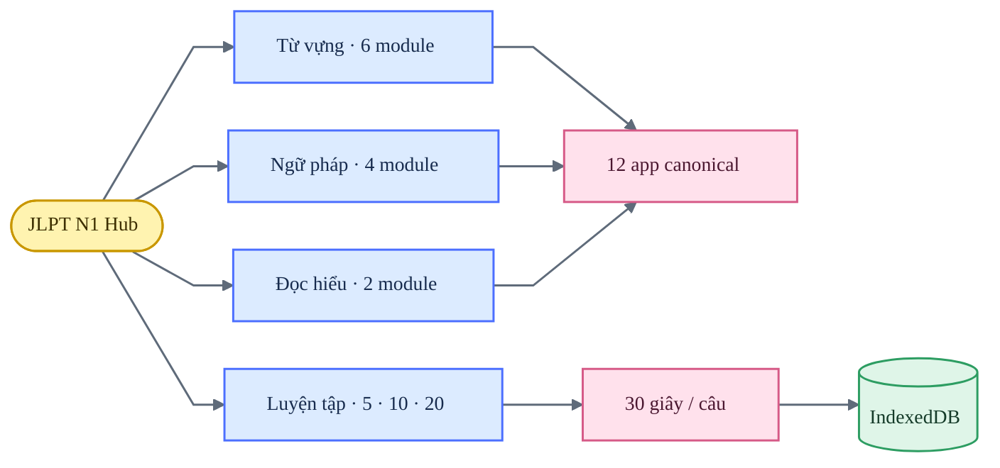

# JLPT N1 — Design QA

**Trạng thái:** đạt

**Xác nhận gần nhất:** 2026-07-22

**Phạm vi:** 390, 680 và 1280 px; light/dark; hub và roadmap

## Kiến trúc nội dung

## Coverage

| Khu vực | Điều đã xác nhận | Kết quả |
|---|---|---|
| Sidebar | Cùng spacing, active state và mobile pattern với BJT | Đạt |
| Màu sắc | Cam cho interaction; xanh chỉ dùng cho brand `thang.` | Đạt |
| Từ vựng | Sáu module, không lặp block luyện theo dạng | Đạt |
| Ngữ pháp | Knowledge, practice và đề thật được tách rõ | Đạt |
| Đọc hiểu | Hai module truy cập trực tiếp từ hub | Đạt |
| Luyện tập | Chọn 5, 10 hoặc 20 câu; 30 giây mỗi câu | Đạt |
| Feedback | Bộ đếm đúng/tổng, đáp án và giải thích cập nhật ngay | Đạt |
| Lịch sử | Phiên, từng câu, thời lượng, mastery và backup JSON | Đạt |
| Responsive | Không tràn ngang; control vẫn thao tác được | Đạt |
| Runtime | Không có lỗi console trong các luồng đã kiểm tra | Đạt |

## Roadmap grid

- Ba trụ cột `Từ vựng N1`, `Ngữ pháp N1` và `Đọc hiểu N1` dùng card grid.
- Desktop ≥1181 px hiển thị ba cột; 821–1180 px hai cột; ≤820 px một cột.
- Mỗi card giữ số thứ tự, trạng thái, số module đã mở và progressbar có accessible label.
- Click toàn card điều hướng đúng hash; theme toggle và mobile menu giữ nguyên.
- Tại 390 và 680 px, ba card xếp một cột và `scrollWidth` bằng viewport.

## Dữ liệu và persistence

- Trạng thái hub và lịch sử luyện tập được lưu trong IndexedDB.
- `jlpt-n1-hub-v1` và `jlpt_wrong` cũ bị xóa một lần, không migration.
- `localStorage` của hub chỉ giữ `theme`.
- Mười hai app con vẫn có progress adapter riêng và chưa ghi toàn bộ chi tiết vào history chung.

## Hồi quy đã kiểm tra

- [x] Chuyển các tab Từ vựng, Ngữ pháp và Đọc hiểu.
- [x] Mở app con rồi quay lại hub; module đã mở vẫn được ghi nhận.
- [x] Chạy phiên 5 câu, gồm đúng, sai và timeout.
- [x] Mở chi tiết từng câu trong Thống kê sau khi hoàn thành.
- [x] Tải lại trang và xác nhận tiến độ vẫn tồn tại.
- [x] Kiểm tra light/dark, menu mobile và horizontal overflow.
- [x] Click roadmap card và xác nhận hash đích.

## Giới hạn

- Quiz chung hiện tập trung vào ngữ pháp; scope từ vựng, đọc hiểu và mixed là bước mở rộng tiếp theo.
- Dữ liệu chi tiết từ 12 app con chưa hợp nhất vào learning history chung.
- IndexedDB là local-first; chưa có đăng nhập hoặc đồng bộ nhiều thiết bị.

Không còn finding P0, P1 hoặc P2 trong phạm vi đã kiểm tra.

**final result: passed**
