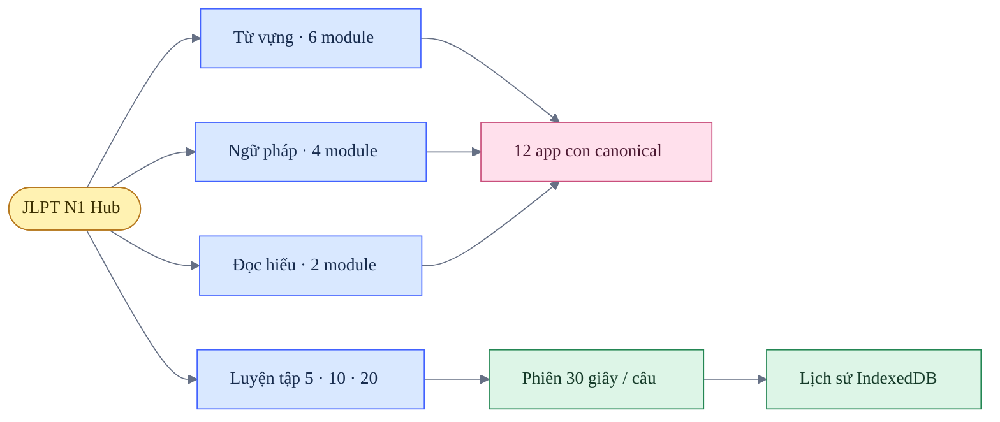

# JLPT N1 — Design QA

**Trạng thái:** đạt

**Lần xác nhận:** 2026-07-21

**Phạm vi:** hub JLPT N1, desktop 1440 × 1024, mobile 390 × 844, giao diện sáng và tối

## Kiến trúc nội dung

## Kết quả

| Khu vực | Tiêu chí | Kết quả |
|---|---|---|
| Sidebar | Cùng chiều rộng, spacing, active state và mobile pattern với BJT | Đạt |
| Màu sắc | Orange là interaction color; xanh chỉ dùng cho brand `thang.` | Đạt |
| Từ vựng | Mỗi tab sở hữu đúng module, không lặp block “Luyện theo dạng” | Đạt |
| Ngữ pháp | Knowledge, practice và đề thật được tách rõ | Đạt |
| Đọc hiểu | Hai module được truy cập trực tiếp từ hub | Đạt |
| Luyện đề | Không còn divider rỗng hoặc nội dung lặp | Đạt |
| Luyện tập | Chọn 5, 10 hoặc 20 câu; 30 giây mỗi câu | Đạt |
| Feedback | Bộ đếm đúng/tổng, đáp án và giải thích tiếng Việt cập nhật ngay | Đạt |
| Lịch sử | Lưu phiên, từng câu, thời lượng, mastery và export/import JSON | Đạt |
| Responsive | 390 px không tràn ngang; controls vẫn thao tác được | Đạt |
| Console | Không có lỗi trong các luồng đã kiểm tra | Đạt |

## Trạng thái dữ liệu

- Trạng thái hub và lịch sử luyện tập mới được lưu trong IndexedDB.
- `jlpt-n1-hub-v1` và `jlpt_wrong` cũ bị xóa một lần, không migration.
- `localStorage` của hub chỉ giữ `theme`.
- Mười hai app con vẫn có adapter tiến độ riêng; chúng chưa cùng ghi chi tiết vào lịch sử chung của hub.

## Checklist hồi quy

- [x] Chuyển toàn bộ tab ở Từ vựng, Ngữ pháp và Đọc hiểu.
- [x] Mở app con rồi trở lại hub; module mới vẫn được ghi nhận.
- [x] Chọn 5 câu, trả lời đúng/sai và kiểm tra timer.
- [x] Hoàn thành phiên và mở chi tiết từng câu trong Thống kê.
- [x] Tải lại trang và xác nhận tiến độ hub vẫn tồn tại.
- [x] Kiểm tra giao diện sáng/tối và mobile.
- [x] Xác nhận không có horizontal overflow.

## Giới hạn đã biết

- Quiz chung hiện tập trung vào ngữ pháp; scope từ vựng, đọc hiểu và mixed là bước mở rộng tiếp theo.
- Dữ liệu chi tiết từ 12 app con chưa được hợp nhất vào learning history chung.
- IndexedDB là local-first; chưa có đăng nhập hoặc đồng bộ đa thiết bị.
