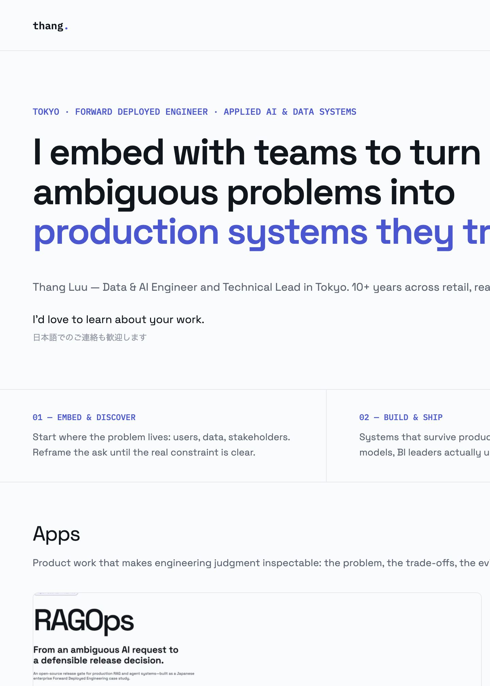
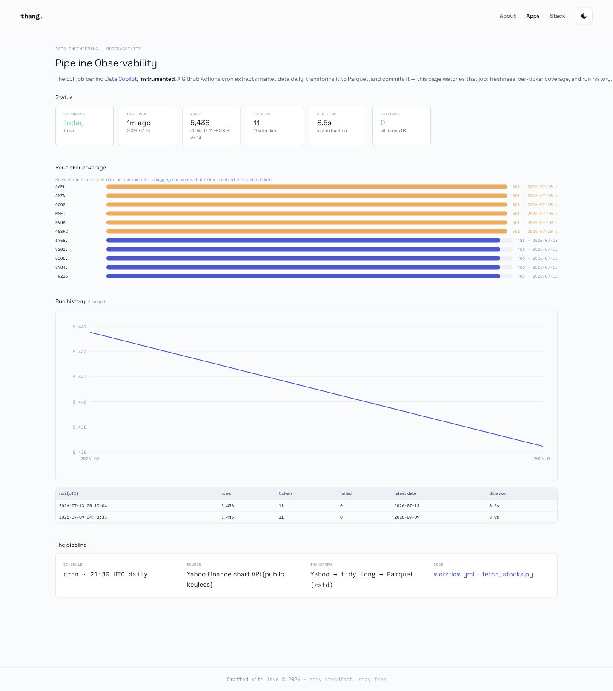

# Stable release audit — 2026-07-13

Scope: Home, Apps, Data Copilot, Pipeline Observability, Japanese study apps, canonical migrations, responsive behavior, quiz interaction, keyboard semantics, and visual contrast. Security testing was intentionally excluded at the user's request.

## Outcome

The documented release backlog is complete. Pipeline history persists, long vocabulary pages render incrementally, canonical URLs and redirects are published, the core study interactions are keyboard-operable, and the final local validation suite passes.

## Evidence

1. Pipeline history contains two successful local refresh runs and the workflow now stages `runs.json`.
2. All 10 legacy Japanese-app URLs redirect to the canonical routes on the public GitHub Pages domain.
3. Responsive QA covered six representative routes at 320, 390, 768, 1024, 1280, and 1440 CSS pixels: 36 checks, zero horizontal-overflow failures.
4. A 720px CSS viewport (the layout equivalent of a 1440px viewport at 200% browser zoom) covered the same six routes with zero horizontal-overflow failures.
5. Vocabulary Tabs and Vocabulary Exams passed computed-style contrast checks in light and dark themes: 4,202 visible text/control samples, zero failures after remediation.
6. Vocabulary quiz QA covered initial, answered, explanation, next, result, and reset states. Reading practice answers are native buttons and disable after selection.
7. The offline validator passed 32 HTML pages, 10 redirects, 18 sitemap URLs, duplicate-ID checks, canonical targets, and all local references.
8. The post-deploy public pass confirmed Home, Apps, Data Copilot, Pipeline, and Vocabulary Tabs with zero horizontal overflow; Pipeline rendered two run-history rows, all 10 legacy redirects reached their canonical route, and the Prefix/Suffix view rendered 44 expandable groups.

## Screenshots

## Evidence limits

The in-app browser does not expose a native browser-zoom command, so the 200% layout check used the standards-equivalent 720 CSS-pixel viewport. Keyboard behavior was exercised directly for custom expandable cards and through native button semantics for tabs, filters, quiz answers, theme and audio controls. The final public-route verification completed after v1.3.0 became visible on GitHub Pages.
