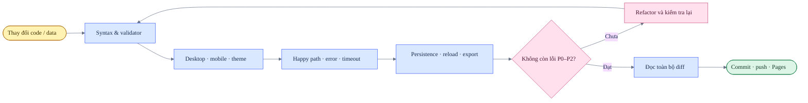

# Design QA — thangldw.github.io

Tài liệu này là release gate cấp repository. Chi tiết từng chương trình học nằm trong:

- [JLPT N1 Design QA](apps/jlpt-n1/design-qa.md)
- [BJT Study Design QA](apps/bjt-study/design-qa.md)
- [Japanese Learning Apps Audit](japanese-app-audit.md)

## Mô hình QA

## Trạng thái hiện tại

| Phạm vi | Desktop | Mobile | Dark mode | Dữ liệu | Kết quả |
|---|---:|---:|---:|---:|---|
| Trang chủ và catalog | Đạt | Đạt | Đạt | Không áp dụng | Đạt |
| JLPT N1 hub | Đạt | Đạt | Đạt | IndexedDB | Đạt |
| BJT Study | Đạt | Đạt | Đạt | IndexedDB | Đạt |
| 12 app JLPT con | Đạt | Đạt | Đạt | Adapter riêng | Đạt, cần hợp nhất lịch sử |
| Redirect compatibility | Đạt | Đạt | Không áp dụng | Không áp dụng | Đạt |

## Design contract dùng chung

- Canvas sáng là warm paper; canvas tối là warm charcoal.
- Orange biểu thị active/action trong learning apps; màu xanh chỉ giữ vai trò brand.
- Sidebar desktop và mobile dùng cùng thứ tự điều hướng, spacing và trạng thái focus.
- Answer, feedback và explanation không được quay về nền trắng lạnh trong dark mode.
- Nội dung từ vựng tách `Từ vựng`, `Cách đọc`, `Âm Hán Việt`, `Ý nghĩa`, `Ví dụ`.
- Nội dung ngữ pháp tách `Mẫu câu`, `Ý nghĩa`, `Giải thích tiếng Việt`, `Ví dụ`, `Bản dịch`.
- Luyện tập hiển thị câu hiện tại, đúng/tổng, timer và trạng thái hết giờ.
- Mọi control phải có focus-visible, nhãn truy cập được và không phụ thuộc duy nhất vào màu.

## Release checklist

### Code và repository

- [ ] Không còn code chết, duplicate module hoặc debug log.
- [ ] Không commit cache, file tạm, ảnh bằng chứng ngoài repository hoặc secret.
- [ ] File mới có consumer rõ ràng; asset cũ không còn dùng phải được xóa.
- [ ] `git diff --check` không báo lỗi.
- [ ] `git status --short` chỉ chứa thay đổi thuộc phạm vi release.

### Chức năng

- [ ] Happy path hoàn tất từ điểm vào đến kết quả.
- [ ] Empty, wrong-answer, timeout và reload state hoạt động.
- [ ] Dữ liệu mới tồn tại sau reload.
- [ ] Export/import được kiểm tra khi schema thay đổi.

### Giao diện

- [ ] Desktop và mobile không có horizontal overflow.
- [ ] Light/dark theme có độ tương phản và surface nhất quán.
- [ ] Text Nhật–Việt không bị cắt, tràn hoặc lẫn trường dữ liệu.
- [ ] Keyboard focus và reduced-motion vẫn hoạt động.

### Phát hành

- [ ] Chạy `python3 scripts/validate_site.py`.
- [ ] Chạy syntax check cho JavaScript đã thay đổi.
- [ ] Đọc toàn bộ diff trước commit.
- [ ] GitHub Pages deployment hoàn tất thành công.
- [ ] Kiểm tra URL live tải đúng version asset mới.

## Chính sách bằng chứng

- Không ghi đường dẫn `/tmp`, clipboard hoặc ảnh nằm ngoài repository vào báo cáo dài hạn.
- Ảnh tạm chỉ dùng trong phiên QA và có thể xóa sau khi kết luận.
- Báo cáo giữ lại viewport, state, bước tái hiện, kết quả và giới hạn kiểm tra.
- Nếu cần bằng chứng lâu dài, asset phải được đặt trong thư mục tài liệu của repository và có liên kết tương đối.

## Mức độ lỗi

| Mức | Ý nghĩa | Release gate |
|---|---|---|
| P0 | Mất dữ liệu, không mở được app hoặc lỗi bảo mật nghiêm trọng | Chặn release |
| P1 | Luồng chính không hoàn thành hoặc sai kết quả | Chặn release |
| P2 | Lỗi responsive, accessibility hoặc state quan trọng | Chặn release |
| P3 | Khác biệt polish không làm hỏng tác vụ | Ghi nhận và lên lịch |
