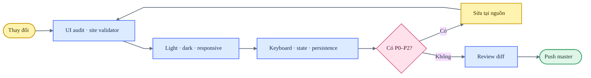

# Repository Design QA

**Trạng thái:** đạt

**Xác nhận gần nhất:** 2026-07-22

**Chuẩn áp dụng:** [UI Standard 1.1](UI-STANDARDS.md)

Tài liệu này là snapshot QA hiện tại của toàn repository. Chi tiết theo từng chương trình nằm trong các báo cáo G検定, BJT và JLPT N1; lịch sử thay đổi đã được gom lại thành các finding và invariant còn giá trị.

## Release flow



## Phạm vi hiện tại

| Nhóm | Coverage | Kết quả |
|---|---|---|
| Public UI | 24 public pages theo audit tự động | Đạt |
| Site structure | 38 HTML pages, 14 redirects, 23 sitemap URLs | Đạt |
| Viewport | 390, 680, 1280 và 1440 px | Đạt |
| Theme | Light/dark; KakeFlow giữ ngoại lệ light-only đã ghi trong ledger | Đạt |
| Learning Programs | G検定, BJT, JLPT N1 và 12 app JLPT con | Đạt |
| Browser smoke | 13 luồng hành vi trên Chrome headless | Đạt |
| JLPT N1 matrix | 13 route × 4 viewport = 52 lượt render | Đạt |
| Redirect | Mapping legacy ↔ canonical được đối chiếu tự động | Đạt |
| Data | G検定 900 câu/495 keyword; BJT 1.565 thuật ngữ/84 mẫu | Đạt schema |

## Contract kiểm tra

- Mỗi trang có đúng một `main`, một source `h1` và heading hierarchy hợp lệ.
- Controls có type, accessible name, keyboard behavior, `:focus-visible` và target tối thiểu theo UI Standard 1.1.
- Tabs có tablist được đặt tên, roving tabindex và liên kết tab/panel đầy đủ.
- Không có horizontal document overflow ở viewport nhỏ nhất 390 px.
- Màu, spacing, radius và typography đi qua shared token; app ngôn ngữ dùng lớp readability chung.
- Font và icon ở local; runtime CDN phải có lý do, fallback và error state.
- Canonical, Open Graph, Twitter metadata, sitemap và local reference phải hợp lệ.
- Legacy debt trong `scripts/ui_legacy_baseline.json` chỉ được giảm, không tăng.

## Finding đã khép lại

### Semantic, controls và accessibility

- Mười legacy learning page đã có semantic `main`; visual title đã đổi thành `h1` hoặc có fallback no-script.
- Data Copilot và các app learning đã hoàn thiện accessible name, tab semantics và keyboard navigation.
- Button học tiếng Nhật dùng radius tối thiểu 8 px; answer/choice dùng 10 px.
- Speech, filter và mobile menu nhỏ đã đạt ngưỡng compact 34 px.
- Vocabulary Tabs đã hợp nhất các định nghĩa CSS lặp thành một nguồn.

### Theme và visual consistency

- Sidebar JLPT/BJT dùng cùng warm-paper canvas `#fbfaf6` ở light và token charcoal ở dark.
- Theme control được hợp nhất thành một icon button cạnh brand, có label truy cập và persistence.
- Tab active, module link, answer state và Leaflet segmented control dùng cùng ngôn ngữ radius/border.
- Nhóm Động từ ghép không còn surface navy nặng ở light mode; light/dark đều dùng token phù hợp.
- G検定 dùng accent `var(--accent, #c84d24)` cho metric, CTA, selected state và focus.

### Responsive roadmap

- G検定 có 11 syllabus card; JLPT có ba pillar card.
- Grid dùng ba cột từ 1181 px, hai cột ở 821–1180 px và một cột từ 820 px trở xuống.
- Card giữ title, trạng thái, count và progressbar semantic; click điều hướng đúng topic/hash.
- Không phát sinh overflow tại 390 hoặc 680 px.

### Content và persistence

- G検定 hiển thị UI/câu hỏi tiếng Nhật; phần giải thích sau lựa chọn dùng Nhật–Việt.
- G検定 topic guide thay “question bank” bằng nội dung cần nhớ, keyword và câu minh họa.
- JLPT/BJT lưu session, answer, duration, mastery và backup JSON trong IndexedDB.
- `localStorage` của hub chỉ giữ tùy chọn theme; key tiến độ cũ được cleanup một lần.

## Bằng chứng và cách tái kiểm tra

### Static gates

```bash
python3 scripts/audit_ui_standards.py
python3 scripts/validate_site.py
node scripts/smoke_learning_apps.mjs
node scripts/qa_jlpt_n1.mjs
git diff --check
```

Smoke suite mở browser thật và kiểm tra roadmap/navigation của G検定, BJT, JLPT N1. Vocabulary Exams kiểm tra search, card expansion, quiz feedback và tab Sai → Đúng; Vocabulary Tabs kiểm tra search, card expansion, đủ 7 tab, Pattern và keyboard; Grammar Exams kiểm tra chọn đáp án, giải thích, lưu/ôn câu sai; Kanji Analysis kiểm tra tìm kiếm, lọc kỳ và chi tiết; Kanji Collocations kiểm tra chọn đáp án, feedback, chuyển câu, Set Phrases và mobile overflow ở 390 × 844.

### Browser matrix

1. Mở mọi route canonical tại 390, 680, 1280 và 1440 px.
2. Kiểm tra light/dark, initial/loading/empty/error và selected/correct/wrong khi các state tồn tại.
3. Dùng keyboard cho navigation, tab, filter, dialog, answer và theme control.
4. Đọc computed style cho target size, radius, focus, background và document `scrollWidth`.
5. Kiểm tra console, ảnh lỗi, route/hash, reload persistence và export/import.

### Chính sách bằng chứng

- Screenshot và crop tạm chỉ dùng trong phiên QA, không commit mặc định.
- Báo cáo giữ viewport, state, bước tái hiện, kết quả và giới hạn.
- Bằng chứng cần lưu lâu dài phải nằm trong thư mục tài liệu và có relative link.

## Mức độ lỗi

| Mức | Ý nghĩa | Release gate |
|---|---|---|
| P0 | Mất dữ liệu, không mở được app hoặc lỗi bảo mật nghiêm trọng | Chặn release |
| P1 | Luồng chính không hoàn thành hoặc kết quả sai | Chặn release |
| P2 | Lỗi responsive, accessibility hoặc state quan trọng | Chặn release |
| P3 | Polish hoặc giới hạn không làm hỏng tác vụ | Ghi nhận |

## Giới hạn còn lại

- Automated G検定 audit không thay thế factual review 900/900 câu bởi chuyên gia JDLA.
- Mười hai app JLPT con chưa ghi đầy đủ activity vào learning history chung của hub.
- Chưa có đăng nhập hoặc cloud sync nhiều thiết bị; local-first vẫn là mặc định.
- DOM/computed-style và visual checks không thay thế kiểm thử VoiceOver/NVDA trên thiết bị thật.
- Legacy single-file debt vẫn tồn tại nhưng bị đóng băng trong `scripts/ui_legacy_baseline.json` và chỉ được phép giảm.

## Refactor Vocabulary Exams — 2026-07-22

- Tách hai khối CSS khỏi HTML sang `apps/n1-vocabulary-exams/styles.css`.
- Thay inline event handler bằng event delegation theo `data-action`, `data-tab`, `data-pos` và `data-option`.
- Thay toàn bộ inline presentation bằng class có tên; bổ sung `type="button"` cho static và dynamic control.
- Debt ledger của route giảm từ 2 style block, 176 style attribute, 20 event handler và 11 button thiếu type xuống 0.
- Dữ liệu 648 từ vẫn nằm nguyên trong JSON source; refactor không thay nội dung học hoặc đáp án.
- Chrome smoke xác nhận filter, mở card, bắt đầu quiz, chọn đáp án, feedback và layout 390 px hoạt động.

## Refactor Vocabulary Tabs — 2026-07-22

- Tách CSS nội bộ sang `apps/n1-vocabulary-tabs/styles.css`; HTML chỉ còn liên kết stylesheet.
- Chuẩn hóa renderer của 7 tab sang class có tên và một lớp event delegation dùng `data-*`.
- Debt ledger của route giảm từ 1 style block, 73 style attribute, 39 event handler và 8 button thiếu type xuống 0.
- Checksum của 8 payload JSON lớn không đổi, nên toàn bộ dữ liệu từ vựng và ví dụ được giữ nguyên.
- Chrome smoke xác nhận tìm kiếm, mở card bằng chuột/bàn phím, tất cả tab, Pattern và layout 390 px hoạt động.

## Refactor Grammar Exams — 2026-07-22

- Tách CSS nội bộ sang `apps/n1-grammar-exams/styles.css` và chuẩn hóa renderer sang class có tên.
- Thay inline handler bằng event delegation theo `data-tab`, `data-period`, `data-year` và `data-action`.
- Debt ledger giảm từ 1 style block, 23 style attribute, 22 event handler và 19 button thiếu type xuống 0.
- Checksum hai payload lớn chứa 300 câu, đáp án và giải thích không đổi.
- Chrome smoke xác nhận chọn đáp án, feedback, giải thích, Danh sách, Ôn sai và layout 390 px hoạt động.

## Refactor Kanji Analysis — 2026-07-22

- Tách CSS nội bộ sang `apps/n1-kanji-analysis/styles.css` và thay handler inline bằng event delegation.
- Debt ledger giảm từ 1 style block, 32 event handler và 27 button thiếu type xuống 0.
- Checksum payload chứa 348 mục phân tích kanji không đổi.
- Chrome smoke xác nhận tìm kiếm, lọc theo kỳ, mở chi tiết bằng chuột/bàn phím và layout 390 px hoạt động.

## Refactor Kanji Collocations — 2026-07-22

- Tách CSS nội bộ sang `apps/n1-kanji-collocations/styles.css` và thay toàn bộ handler inline bằng event delegation qua `data-action` / `data-mode`.
- Thêm `type="button"`, class trạng thái cho modal/progress và giữ nguyên checksum của payload `KANJI_VOCAB`.
- Legacy debt của route giảm từ `1 / 8 / 18 / 17` xuống `0 / 0 / 0 / 0` theo thứ tự style block / style attribute / event handler / button thiếu type.
- Chrome smoke xác nhận chọn đáp án, feedback, lưu câu sai, chuyển câu, Set Phrases và layout 390 px hoạt động.

## Tách payload JLPT N1 — 2026-07-22

- Tách dữ liệu khỏi HTML của Vocabulary Tabs, Vocabulary Exams, Grammar Exams, Kanji Analysis và Kanji Collocations sang `data.js` theo từng route.
- Tổng kích thước năm HTML giảm từ khoảng 2,07 MB xuống khoảng 149 KB; các payload được cache và bảo trì độc lập với markup/logic giao diện.
- Hash của dữ liệu đã parse trước/sau trùng khớp cho cả năm route; 13/13 Chrome smoke test tiếp tục đạt.

## Full QA JLPT N1 — 2026-07-22

- Chạy 52 lượt render cho hub và 12 app tại 390, 680, 1280 và 1440 px; không có overflow, lỗi JavaScript, ảnh hỏng, ID trùng, mojibake hoặc lỗi landmark/heading.
- Bổ sung accessible label cho filter, search, quiz setup và jump control ở chín app; tăng target compact của brand và nút phát âm lên tối thiểu 34 px.
- Sửa contrast dark mode của giải thích Grammar Exams và bảng/ghi chú Kanji Analysis bằng token `--portfolio-*`.
- Tải local ở desktop nằm trong khoảng 49–143 ms; payload đã giải mã từ 96 KB đến 858 KB, không route nào vượt budget 2,5 MB.
- Kiểm tra schema nội dung xác nhận Grammar Exams có 300/300 giải thích, Kanji Analysis có 348 mục, Kanji Collocations có 527 mục và mọi đáp án quiz đều trỏ tới lựa chọn hợp lệ.
- Giới hạn dữ liệu còn lại: 345/648 mục Vocabulary Exams chưa có trường nghĩa Việt riêng; câu hỏi và đáp án vẫn đầy đủ, nhưng cần một đợt biên tập ngôn ngữ riêng thay vì tự động điền bản dịch chưa được kiểm chứng.

Không còn finding P0, P1 hoặc P2 có thể hành động trong phạm vi QA hiện tại.

**final result: passed**

## Vocabulary Exams compact library shell — 2026-07-22

### Comparison target

- Source visual truth: `/var/folders/sm/d8hb2_5s40965vv4h1zxl_xc0000gn/T/codex-clipboard-e47c93fd-155c-4203-a641-e739a1090108.png`.
- Implementation screenshot: `/tmp/n1-vocabulary-exams-after.png`.
- Responsive evidence: `/tmp/n1-vocabulary-exams-mobile.png` and `/tmp/n1-vocabulary-exams-mobile-dark.png`.
- Desktop viewport: 1990 × 722 CSS px; source file 1990 × 722 px; browser capture 1961 × 722 px because the in-app browser reserves its scrollbar region; device scale factor 1.
- Mobile viewport: 390 × 844 CSS px; capture 390 × 844 px; device scale factor 1.
- State: `単語リスト`, all filters selected, light theme for the primary comparison; mobile checked in both light and dark themes.

### Full-view and focused comparison evidence

The source capture was the rejected state rather than a desired mock. The comparison therefore checks whether the reported visual problems were removed while preserving the same information and controls. Source and implementation were opened together in one visual comparison input. The implementation reduces the oversized headline, constrains header and tabs to the content grid, replaces filled boxed tabs with a quiet underline state, groups search/select/count controls in one toolbar, and keeps three vocabulary columns at desktop.

Focused checks covered the header title and badges, tab selected state, search/select row, part-of-speech controls and the first vocabulary-card row. No image or custom icon asset was required; the affected surface contains only typography, controls and borders.

### Required fidelity surfaces

- Fonts and typography: UI and Japanese font tokens are retained; desktop title is 36 px/1.08 and mobile title is 28 px without clipping.
- Spacing and layout rhythm: content aligns to the 1328 px repository grid; header is 107 px high; tabs are 48 px; toolbar spacing follows the shared scale; no horizontal overflow at 390 or 1990 px.
- Colors and tokens: canvas, surfaces, borders, ink, muted text and accent use shared portfolio tokens in light and dark themes.
- Image quality: not applicable; the component has no raster, logo or illustration asset.
- Copy and content: exam name, 問題1〜4, counts, tabs, filters and all study data are preserved.

### Comparison history

1. Initial finding — P1: the title dominated the screen and combined English, Japanese and date metadata in one line. Fix: split metadata, title and statistics into a compact responsive header.
2. Initial finding — P2: tabs looked like large filled buttons and competed with the content. Fix: introduced a semantic tablist with a transparent underline-selected state and roving keyboard focus.
3. Initial finding — P2: search, selects, count and part-of-speech filters lacked a shared container and broke visual rhythm. Fix: grouped them into a bordered toolbar with a responsive grid.
4. Post-fix evidence: desktop and mobile captures show the fixes; 390 px has `scrollWidth === 390`; 1990 px has no document overflow; light/dark console checks contain no errors or warnings.

### Findings

No actionable P0, P1 or P2 findings remain. The source crop omits the global site header while the browser evidence includes it; this is an expected capture-boundary difference and does not affect the redesigned component.

### Interaction verification

- Mouse/touch tab selection switches the correct tabpanel.
- ArrowRight moves focus and selection to the next tab.
- Search, native selects and part-of-speech buttons retain minimum target sizes and accessible names.
- Filter buttons expose `aria-pressed`; tabs expose `role`, `aria-selected`, `aria-controls` and roving `tabindex`.
- Browser console: zero errors and warnings in mobile light/dark checks.

**final result: passed**
