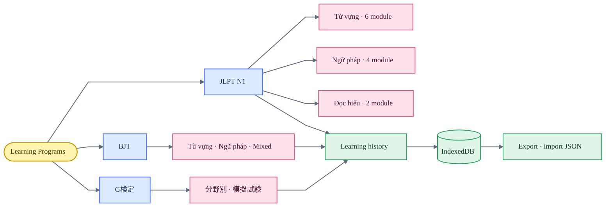
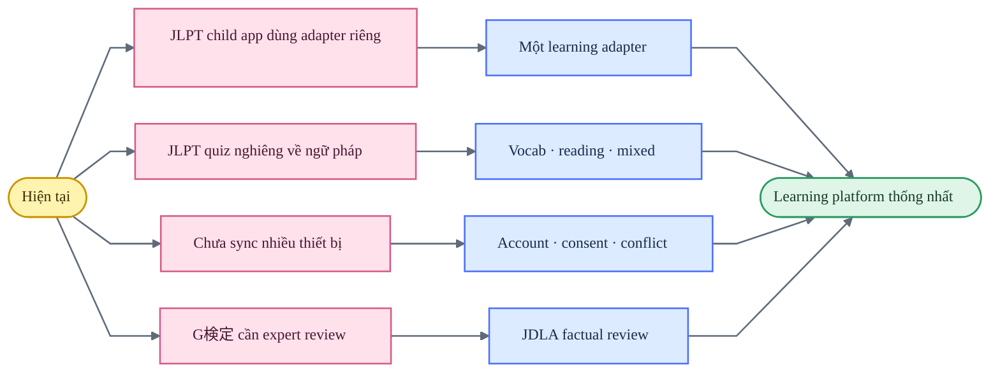

# Audit Learning Programs

**Ngày cập nhật:** 2026-07-22

**Phạm vi:** G検定, BJT Study, JLPT N1 hub và 12 app JLPT con

## Bản đồ hệ sinh thái

## Kết luận

- Ba chương trình dùng cùng ngôn ngữ layout, spacing, theme switch và lịch sử học local-first.
- G検定 có 11 lĩnh vực, 900 câu, 495 keyword và mock exam 145 câu/120 phút; toàn UI bằng tiếng Nhật, giải thích sau đáp án bằng Nhật–Việt.
- BJT có 9 module, 1.565 thuật ngữ, 84 mẫu ngữ pháp và 30 nhóm ý nghĩa.
- JLPT tổ chức 12 app con thành 6 module từ vựng, 4 module ngữ pháp và 2 module đọc hiểu.
- Learning history dùng chung lưu phiên, câu trả lời, thời lượng, mastery, lịch ôn và backup JSON.
- Light/dark, correct/wrong/selected, keyboard focus và mobile overflow đã được kiểm tra trên các luồng chính.

## Coverage

| Bề mặt | Initial | Answer/detail | Mobile | Kết quả |
|---|---:|---:|---:|---|
| G検定 | Đã kiểm tra | Đã kiểm tra | Đã kiểm tra | Đạt |
| BJT Study | Đã kiểm tra | Đã kiểm tra | Đã kiểm tra | Đạt |
| JLPT N1 Hub | Đã kiểm tra | Đã kiểm tra | Đã kiểm tra | Đạt |
| Grammar Exams | Đã kiểm tra | Đã kiểm tra | Đã kiểm tra | Đạt |
| Grammar Flashcards | Đã kiểm tra | Flip state | Đã kiểm tra | Đạt |
| Grammar Sentence Order | Đã kiểm tra | Set state | Đã kiểm tra | Đạt |
| Grammar Sentence Order Drill | Đã kiểm tra | Choice state | Đã kiểm tra | Đạt |
| Kanji Analysis | Đã kiểm tra | Expanded state | Đã kiểm tra | Đạt |
| Kanji & Collocations | Đã kiểm tra | Đã kiểm tra | Đã kiểm tra | Đạt |
| Reading 75 | Đã kiểm tra | Đã kiểm tra | Đã kiểm tra | Đạt |
| Reading 問題9 | Đã kiểm tra | Đã kiểm tra | Đã kiểm tra | Đạt |
| Context Vocabulary | Đã kiểm tra | Đã kiểm tra | Đã kiểm tra | Đạt |
| Vocabulary Exams | Đã kiểm tra | Dense grid | Đã kiểm tra | Đạt |
| Vocabulary Paraphrase | Đã kiểm tra | Reference grid | Đã kiểm tra | Đạt |
| Vocabulary Tabs | Đã kiểm tra | Reference grid | Đã kiểm tra | Đạt |

## Điểm mạnh

- Warm paper và warm charcoal phù hợp cho phiên đọc dài.
- Nội dung Nhật–Việt có hierarchy rõ; dữ liệu từ vựng, ngữ pháp và giải thích không bị trộn trường.
- Correct, wrong, selected, hover và focus state có ngữ nghĩa ổn định.
- Progressive disclosure giữ danh sách gọn nhưng vẫn cung cấp chi tiết khi cần.
- Program hub đưa người học tới mục tiêu thay vì buộc họ hiểu cấu trúc app bên dưới.
- `js/learning-history.js` cung cấp một contract chung cho course hiện tại và tương lai.

## Khoảng trống ưu tiên

1. Chuẩn hóa event contract `session`, `answer`, `item`, `result`, `duration`, `mastery` cho 12 app JLPT con.
2. Mở rộng quiz JLPT sang từ vựng, đọc hiểu, mixed, câu sai và nội dung chưa gặp.
3. Giữ local-first làm mặc định; chỉ thêm cloud sync cùng đăng nhập, consent, xóa dữ liệu và xử lý conflict.
4. Thực hiện editorial review định kỳ cho dữ liệu BJT và factual review độc lập cho 900 câu G検定.

## Accessibility và giới hạn audit

- Đã kiểm tra focus-visible, heading/button semantics, speaker label, reduced motion, contrast và mobile overflow trong các state chính.
- Viewport đại diện: 390 × 844 cho mobile và 1440 × 1024 cho desktop.
- Đây là visual/interaction audit, không phải chứng nhận WCAG hoặc kiểm thử screen reader đầy đủ.
- Speech phụ thuộc Web Speech API và voice tiếng Nhật của thiết bị.
- Quy trình tái kiểm tra và giới hạn bằng chứng nằm trong [design-qa.md](design-qa.md).

**final result: passed**
