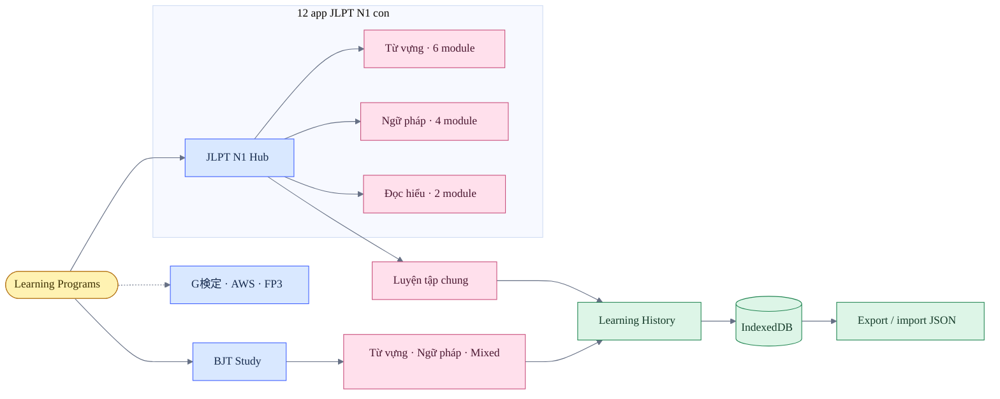
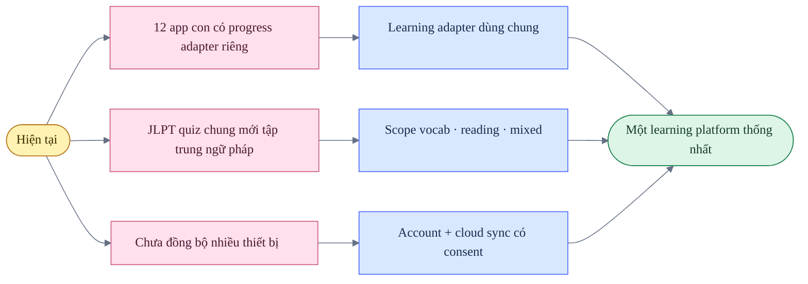

# Audit hệ sinh thái học tiếng Nhật

**Ngày cập nhật:** 2026-07-21

**Phạm vi:** JLPT N1 hub, BJT Study và 12 app JLPT N1 con

## Bản đồ hệ sinh thái

## Kết luận nhanh

- Hai hub đã thống nhất sidebar, màu sắc, spacing, theme switch và cách gọi tên chức năng.
- BJT cung cấp lộ trình 9 module, 1.565 thuật ngữ, 84 mẫu ngữ pháp và 30 nhóm ý nghĩa.
- JLPT tổ chức 12 app con thành 6 module từ vựng, 4 module ngữ pháp và 2 module đọc hiểu.
- Cả hai hub có luyện tập 5, 10 hoặc 20 câu, giới hạn 30 giây mỗi câu và hiển thị đúng/tổng.
- Learning history dùng chung lưu phiên, từng câu trả lời, thời lượng, mastery, lịch ôn và backup JSON.
- Dark mode không còn surface trả lời trắng lạnh trong các state đã kiểm tra.

## Coverage

| Bề mặt | Initial state | Answer/detail state | Mobile | Kết quả |
|---|---:|---:|---:|---|
| JLPT N1 Hub | Đã kiểm tra | Đã kiểm tra | Đã kiểm tra | Đạt |
| BJT Study | Đã kiểm tra | Đã kiểm tra | Đã kiểm tra | Đạt |
| Grammar Exams | Đã kiểm tra | Đã kiểm tra | Đã kiểm tra | Đạt |
| Grammar Flashcards | Đã kiểm tra | Flip state | Đã kiểm tra | Đạt |
| Grammar Sentence Order | Đã kiểm tra | Set state | Đã kiểm tra | Đạt |
| Grammar Sentence Order Drill | Đã kiểm tra | Choice state | Đã kiểm tra | Đạt |
| Kanji Analysis | Đã kiểm tra | Expanded state | Đã kiểm tra | Đạt |
| Kanji & Collocations | Đã kiểm tra | Đã kiểm tra | Đã kiểm tra | Đạt |
| Reading 75 | Đã kiểm tra | Đã kiểm tra | Đã kiểm tra | Đạt |
| Reading 問題9 | Đã kiểm tra | Đã kiểm tra | Đã kiểm tra | Đạt |
| Context Vocabulary | Đã kiểm tra | Đã kiểm tra | Đã kiểm tra | Đạt |
| Vocabulary Exams | Đã kiểm tra | Dense grid | Đã kiểm tra | Đạt |
| Vocabulary Paraphrase | Đã kiểm tra | Reference grid | Đã kiểm tra | Đạt |
| Vocabulary Tabs | Đã kiểm tra | Reference grid | Đã kiểm tra | Đạt |

## Điểm mạnh

- Warm paper và warm charcoal giúp đọc lâu mà không tạo cảm giác trắng chói hoặc đen tuyệt đối.
- Tương phản Nhật–Việt rõ; từ vựng và ngữ pháp dùng cấu trúc trường dữ liệu riêng.
- Correct, wrong, selected, hover và focus state có ngữ nghĩa ổn định.
- BJT dùng progressive disclosure để giữ danh sách gọn nhưng vẫn cung cấp Kanji, bẫy đọc, collocation và từ đồng nghĩa khi có dữ liệu.
- Hub giúp người học đi thẳng tới nội dung theo mục tiêu thay vì phải hiểu cấu trúc 12 app con.
- Kiến trúc history dùng chung có thể tái sử dụng cho G検定, AWS Cloud và FP3.

## Khoảng trống còn lại

### Ưu tiên 1 — hợp nhất progress adapter

Mỗi app con cần gửi cùng một event contract: `session`, `answer`, `item`, `result`, `duration`, `mastery`. Đây là điều kiện để phần Thống kê JLPT phản ánh toàn bộ hoạt động thay vì chỉ quiz ở hub.

### Ưu tiên 2 — mở rộng scope luyện JLPT

Setup chung nên cho chọn từ vựng, ngữ pháp, đọc hiểu, mixed, câu sai và nội dung chưa gặp. Timer cần trở thành cấu hình của course thay vì giả định cố định cho mọi chứng chỉ tương lai.

### Ưu tiên 3 — đồng bộ có chủ đích

Local-first tiếp tục là mặc định. Cloud sync chỉ nên được thêm cùng đăng nhập, consent, chính sách xóa dữ liệu và cơ chế giải quyết xung đột nhiều thiết bị.

## Chất lượng dữ liệu BJT

- Phân tích parser giữ `Ý nghĩa` tách khỏi ví dụ Nhật–Việt.
- Kanji insight chỉ hiển thị dữ liệu có nguồn; không tự bịa phần còn thiếu.
- Những thuật ngữ không khớp luật semantic được giữ trong `Khái niệm khác` để người dùng biết giới hạn phân loại.
- Nhóm `Khái niệm khác` vẫn cần editorial pass định kỳ khi bổ sung dữ liệu mới.

## Accessibility và giới hạn audit

- Đã kiểm tra focus-visible, heading/button semantics, aria label cho speaker, reduced-motion và contrast trong các state chính.
- Mobile được kiểm tra ở 390 × 844; desktop ở 1440 × 1024.
- Đây là visual/interaction audit, không phải chứng nhận WCAG hoặc kiểm thử đầy đủ bằng screen reader.
- Speech phụ thuộc Web Speech API và voice tiếng Nhật của thiết bị.
- Bằng chứng tạm không được ghi thành đường dẫn lâu dài trong repository; quy trình tái kiểm tra nằm trong [design-qa.md](design-qa.md).
